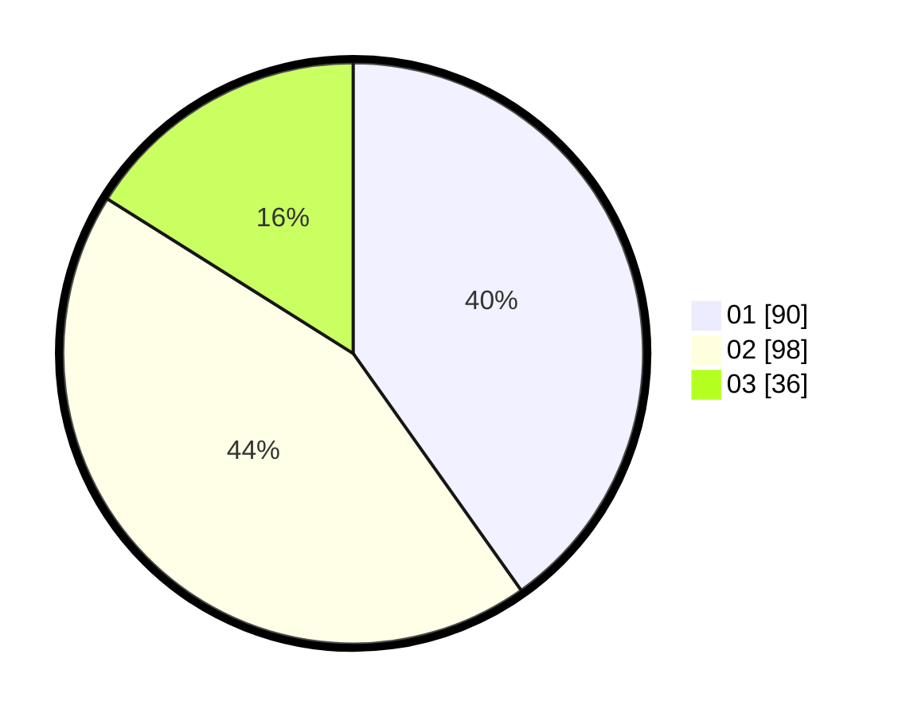

# Hasil

Hasil perolehan suara paslon dapat dilihat pada file paslon-01.txt, paslon-02.txt, dan paslon-03.txt.

Jika tidak ada, artinya data tersebut belum ada pada SIREKAP.

## Perolehan Suara

 * Paslon 01: **90**.
 * Paslon 02: **98**.
 * Paslon 03: **36**.

## Foto C Plano

https://sirekap-obj-formc.kpu.go.id/451f/pemilu/ppwp/31/72/06/10/03/3172061003002-20240217-210411--bbd18c0c-3a6c-47dd-85fb-63a4f01aea67.jpg

https://sirekap-obj-formc.kpu.go.id/451f/pemilu/ppwp/31/72/06/10/03/3172061003002-20240217-210802--9844cb98-1efe-4c0c-8a99-ce33b88f0a99.jpg

https://sirekap-obj-formc.kpu.go.id/451f/pemilu/ppwp/31/72/06/10/03/3172061003002-20240217-210818--d75e5bb7-ef04-4c38-9e52-0cf941646ae9.jpg
