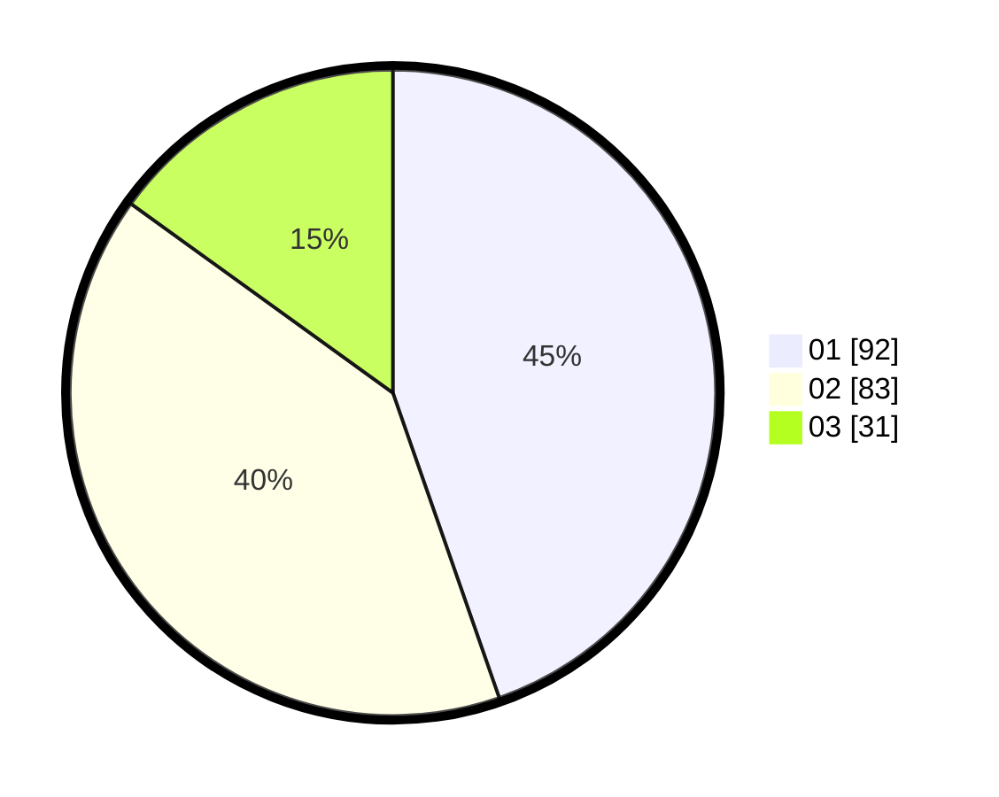

# Hasil

Hasil perolehan suara paslon dapat dilihat pada file paslon-01.txt, paslon-02.txt, dan paslon-03.txt.

Jika tidak ada, artinya data tersebut belum ada pada SIREKAP.

## Perolehan Suara

 * Paslon 01: **92**.
 * Paslon 02: **83**.
 * Paslon 03: **31**.

## Foto C Plano

https://sirekap-obj-formc.kpu.go.id/a9b0/pemilu/ppwp/31/72/06/10/03/3172061003004-20240218-113801--9f47e77f-cfaa-4f1e-8afe-a6c2df725eb6.jpg

https://sirekap-obj-formc.kpu.go.id/a9b0/pemilu/ppwp/31/72/06/10/03/3172061003004-20240218-113921--b549e6ad-7ed4-4420-a05b-21138819801e.jpg

https://sirekap-obj-formc.kpu.go.id/a9b0/pemilu/ppwp/31/72/06/10/03/3172061003004-20240218-114017--ac83bc55-ee62-441a-ba81-dc83a8048687.jpg

## DATA PEMILIH TETAP

Jumlah pemilih dalam DPT: **289**.
 * L: **125**.
 * P: **164**.

## DATA PENGGUNA HAK PILIH

Jumlah pengguna hak pilih dalam DPT: **200**.
 * L: **77**.
 * P: **123**.

Jumlah pengguna hak pilih dalam DPTb: **8**.
 * L: **5**.
 * P: **3**.

Jumlah pengguna hak pilih dalam DPK: **0**.
 * L: **0**.
 * P: **0**.

Jumlah pengguna hak pilih: **208**.
 * L: **82**.
 * P: **126**.

## JUMLAH SUARA SAH DAN TIDAK SAH

JUMLAH SELURUH SUARA SAH: **206**.

JUMLAH SUARA TIDAK SAH: **2**.

JUMLAH SELURUH SUARA SAH DAN SUARA TIDAK SAH: **208**.
