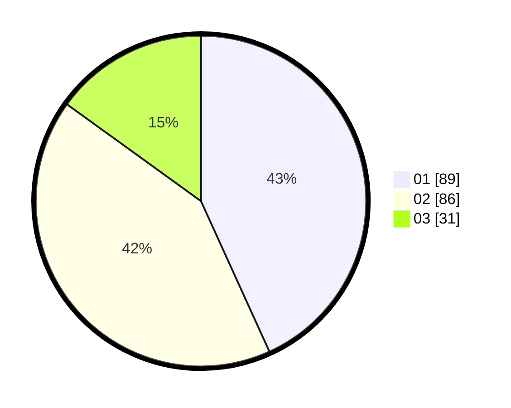

# Hasil

Hasil perolehan suara paslon dapat dilihat pada file paslon-01.txt, paslon-02.txt, dan paslon-03.txt.

Jika tidak ada, artinya data tersebut belum ada pada SIREKAP.

## Perolehan Suara

 * Paslon 01: **89**.
 * Paslon 02: **86**.
 * Paslon 03: **31**.

## Foto C Plano

https://sirekap-obj-formc.kpu.go.id/d650/pemilu/ppwp/31/72/06/10/03/3172061003013-20240214-191903--39fe5004-d5e2-487e-8ca4-7c4dd3421610.jpg

https://sirekap-obj-formc.kpu.go.id/d650/pemilu/ppwp/31/72/06/10/03/3172061003013-20240215-224409--5dcb1e26-a91d-4fbb-ab9e-8f9635e70e8f.jpg

https://sirekap-obj-formc.kpu.go.id/d650/pemilu/ppwp/31/72/06/10/03/3172061003013-20240215-220801--dff15498-7fe2-4687-b483-e814ab262482.jpg

## DATA PEMILIH TETAP

Jumlah pemilih dalam DPT: **276**.
 * L: **122**.
 * P: **154**.

## DATA PENGGUNA HAK PILIH

Jumlah pengguna hak pilih dalam DPT: **196**.
 * L: **81**.
 * P: **115**.

Jumlah pengguna hak pilih dalam DPTb: **7**.
 * L: **1**.
 * P: **6**.

Jumlah pengguna hak pilih dalam DPK: **3**.
 * L: **1**.
 * P: **2**.

Jumlah pengguna hak pilih: **206**.
 * L: **83**.
 * P: **123**.

## JUMLAH SUARA SAH DAN TIDAK SAH

JUMLAH SELURUH SUARA SAH: **206**.

JUMLAH SUARA TIDAK SAH: **0**.

JUMLAH SELURUH SUARA SAH DAN SUARA TIDAK SAH: **206**.
