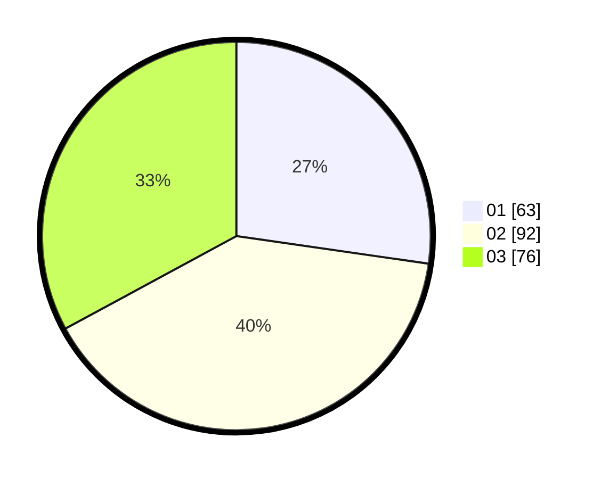

# Hasil

Hasil perolehan suara paslon dapat dilihat pada file paslon-01.txt, paslon-02.txt, dan paslon-03.txt.

Jika tidak ada, artinya data tersebut belum ada pada SIREKAP.

## Perolehan Suara

 * Paslon 01: **63**.
 * Paslon 02: **92**.
 * Paslon 03: **76**.

## Foto C Plano

https://sirekap-obj-formc.kpu.go.id/02e8/pemilu/ppwp/31/72/06/10/03/3172061003023-20240216-120053--fe98b90f-7a20-4be9-bf1f-d007791d8f86.jpg

https://sirekap-obj-formc.kpu.go.id/02e8/pemilu/ppwp/31/72/06/10/03/3172061003023-20240216-191009--4c1a2608-932b-4a92-8eee-f0f1d7148ac9.jpg

https://sirekap-obj-formc.kpu.go.id/02e8/pemilu/ppwp/31/72/06/10/03/3172061003023-20240216-191008--3bb43d55-0b9e-4f73-9163-94f9357c5d39.jpg

## DATA PEMILIH TETAP

Jumlah pemilih dalam DPT: **288**.
 * L: **135**.
 * P: **153**.

## DATA PENGGUNA HAK PILIH

Jumlah pengguna hak pilih dalam DPT: **218**.
 * L: **95**.
 * P: **123**.

Jumlah pengguna hak pilih dalam DPTb: **12**.
 * L: **1**.
 * P: **11**.

Jumlah pengguna hak pilih dalam DPK: **4**.
 * L: **3**.
 * P: **1**.

Jumlah pengguna hak pilih: **234**.
 * L: **99**.
 * P: **135**.

## JUMLAH SUARA SAH DAN TIDAK SAH

JUMLAH SELURUH SUARA SAH: **231**.

JUMLAH SUARA TIDAK SAH: **3**.

JUMLAH SELURUH SUARA SAH DAN SUARA TIDAK SAH: **234**.
