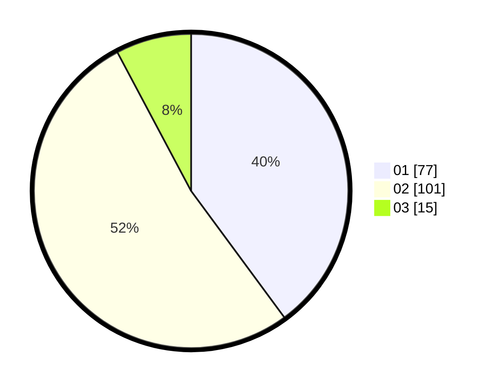

# Hasil

Hasil perolehan suara paslon dapat dilihat pada file paslon-01.txt, paslon-02.txt, dan paslon-03.txt.

Jika tidak ada, artinya data tersebut belum ada pada SIREKAP.

## Perolehan Suara

 * Paslon 01: **77**.
 * Paslon 02: **101**.
 * Paslon 03: **15**.

## Foto C Plano

https://sirekap-obj-formc.kpu.go.id/54f1/pemilu/ppwp/31/72/06/10/03/3172061003029-20240216-185938--66e61c92-880d-4c11-bef4-c48334c19efb.jpg

https://sirekap-obj-formc.kpu.go.id/54f1/pemilu/ppwp/31/72/06/10/03/3172061003029-20240216-185940--7c9e37b6-77e3-4c84-8605-a43ab99c0226.jpg

https://sirekap-obj-formc.kpu.go.id/54f1/pemilu/ppwp/31/72/06/10/03/3172061003029-20240216-185939--11a60269-46f4-4eb0-8b53-f682d4624032.jpg

## DATA PEMILIH TETAP

Jumlah pemilih dalam DPT: **279**.
 * L: **138**.
 * P: **141**.

## DATA PENGGUNA HAK PILIH

Jumlah pengguna hak pilih dalam DPT: **185**.
 * L: **94**.
 * P: **91**.

Jumlah pengguna hak pilih dalam DPTb: **9**.
 * L: **6**.
 * P: **3**.

Jumlah pengguna hak pilih dalam DPK: **2**.
 * L: **1**.
 * P: **1**.

Jumlah pengguna hak pilih: **196**.
 * L: **101**.
 * P: **95**.

## JUMLAH SUARA SAH DAN TIDAK SAH

JUMLAH SELURUH SUARA SAH: **193**.

JUMLAH SUARA TIDAK SAH: **3**.

JUMLAH SELURUH SUARA SAH DAN SUARA TIDAK SAH: **196**.
