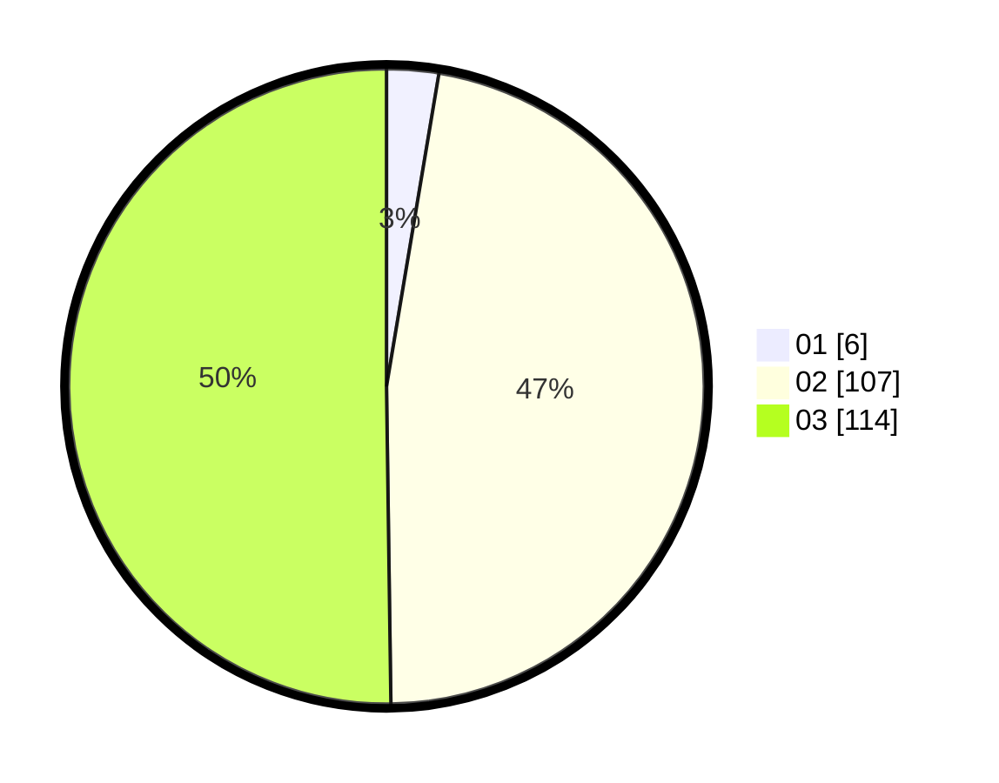

# Hasil

Hasil perolehan suara paslon dapat dilihat pada file paslon-01.txt, paslon-02.txt, dan paslon-03.txt.

Jika tidak ada, artinya data tersebut belum ada pada SIREKAP.

## Perolehan Suara

 * Paslon 01: **6**.
 * Paslon 02: **107**.
 * Paslon 03: **114**.

## Foto C Plano

https://sirekap-obj-formc.kpu.go.id/b644/pemilu/ppwp/31/72/06/10/03/3172061003045-20240214-184541--fea8c3f9-3d44-49d5-b7b9-af91433b1d63.jpg

https://sirekap-obj-formc.kpu.go.id/b644/pemilu/ppwp/31/72/06/10/03/3172061003045-20240214-184851--ee5a1e72-1605-4fdb-b5f1-7a719a6d2aa7.jpg

https://sirekap-obj-formc.kpu.go.id/b644/pemilu/ppwp/31/72/06/10/03/3172061003045-20240214-185058--7350eddc-a262-4561-9c9a-a95dc31cafa5.jpg

## DATA PEMILIH TETAP

Jumlah pemilih dalam DPT: **289**.
 * L: **134**.
 * P: **155**.

## DATA PENGGUNA HAK PILIH

Jumlah pengguna hak pilih dalam DPT: **206**.
 * L: **99**.
 * P: **107**.

Jumlah pengguna hak pilih dalam DPTb: **21**.
 * L: **10**.
 * P: **11**.

Jumlah pengguna hak pilih dalam DPK: **6**.
 * L: **4**.
 * P: **2**.

Jumlah pengguna hak pilih: **233**.
 * L: **113**.
 * P: **120**.

## JUMLAH SUARA SAH DAN TIDAK SAH

JUMLAH SELURUH SUARA SAH: **227**.

JUMLAH SUARA TIDAK SAH: **6**.

JUMLAH SELURUH SUARA SAH DAN SUARA TIDAK SAH: **233**.
