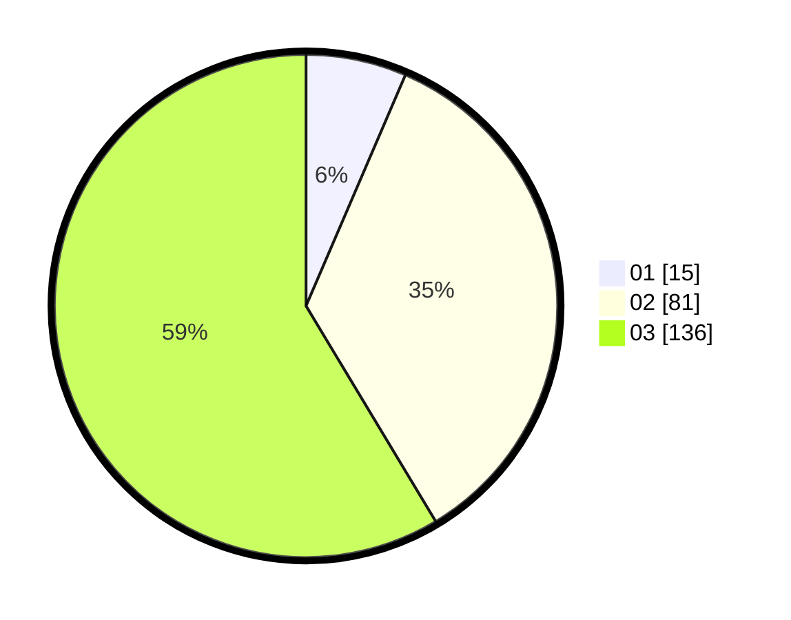

# Hasil

Hasil perolehan suara paslon dapat dilihat pada file paslon-01.txt, paslon-02.txt, dan paslon-03.txt.

Jika tidak ada, artinya data tersebut belum ada pada SIREKAP.

## Perolehan Suara

 * Paslon 01: **15**.
 * Paslon 02: **81**.
 * Paslon 03: **136**.

## Foto C Plano

https://sirekap-obj-formc.kpu.go.id/78b9/pemilu/ppwp/31/72/06/10/03/3172061003048-20240215-231020--e79c65b0-d363-4e49-b29a-2ffebd19ad35.jpg

https://sirekap-obj-formc.kpu.go.id/78b9/pemilu/ppwp/31/72/06/10/03/3172061003048-20240215-231100--f81c16a8-31be-49ae-9ec0-0affda567d64.jpg

https://sirekap-obj-formc.kpu.go.id/78b9/pemilu/ppwp/31/72/06/10/03/3172061003048-20240215-231131--fac91a1b-564e-43e5-a7cf-f18aeb8b5067.jpg

## DATA PEMILIH TETAP

Jumlah pemilih dalam DPT: **278**.
 * L: **133**.
 * P: **145**.

## DATA PENGGUNA HAK PILIH

Jumlah pengguna hak pilih dalam DPT: **208**.
 * L: **100**.
 * P: **108**.

Jumlah pengguna hak pilih dalam DPTb: **14**.
 * L: **7**.
 * P: **7**.

Jumlah pengguna hak pilih dalam DPK: **11**.
 * L: **4**.
 * P: **7**.

Jumlah pengguna hak pilih: **233**.
 * L: **111**.
 * P: **122**.

## JUMLAH SUARA SAH DAN TIDAK SAH

JUMLAH SELURUH SUARA SAH: **232**.

JUMLAH SUARA TIDAK SAH: **1**.

JUMLAH SELURUH SUARA SAH DAN SUARA TIDAK SAH: **233**.
