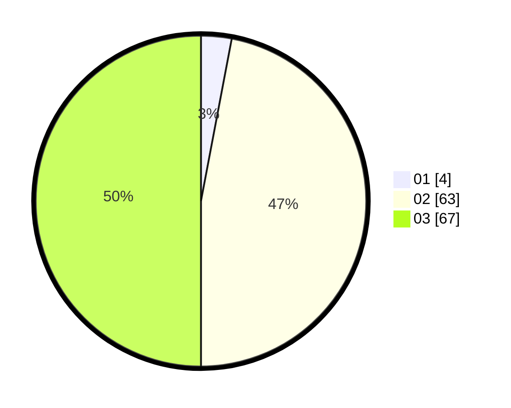

# Hasil

Hasil perolehan suara paslon dapat dilihat pada file paslon-01.txt, paslon-02.txt, dan paslon-03.txt.

Jika tidak ada, artinya data tersebut belum ada pada SIREKAP.

## Perolehan Suara

 * Paslon 01: **4**.
 * Paslon 02: **63**.
 * Paslon 03: **67**.

## Foto C Plano

https://sirekap-obj-formc.kpu.go.id/d6a4/pemilu/ppwp/31/72/06/10/03/3172061003050-20240214-155723--1aca8445-d56f-4294-8bfa-240771a91b08.jpg

https://sirekap-obj-formc.kpu.go.id/d6a4/pemilu/ppwp/31/72/06/10/03/3172061003050-20240214-155215--603c9061-e155-4231-8710-39cffdc77bf6.jpg

https://sirekap-obj-formc.kpu.go.id/d6a4/pemilu/ppwp/31/72/06/10/03/3172061003050-20240214-155227--23adf1d1-2d07-4b77-afc1-fd05db224d44.jpg

## DATA PEMILIH TETAP

Jumlah pemilih dalam DPT: **182**.
 * L: **80**.
 * P: **102**.

## DATA PENGGUNA HAK PILIH

Jumlah pengguna hak pilih dalam DPT: **113**.
 * L: **50**.
 * P: **63**.

Jumlah pengguna hak pilih dalam DPTb: **18**.
 * L: **11**.
 * P: **7**.

Jumlah pengguna hak pilih dalam DPK: **4**.
 * L: **2**.
 * P: **2**.

Jumlah pengguna hak pilih: **135**.
 * L: **63**.
 * P: **72**.

## JUMLAH SUARA SAH DAN TIDAK SAH

JUMLAH SELURUH SUARA SAH: **134**.

JUMLAH SUARA TIDAK SAH: **1**.

JUMLAH SELURUH SUARA SAH DAN SUARA TIDAK SAH: **135**.
