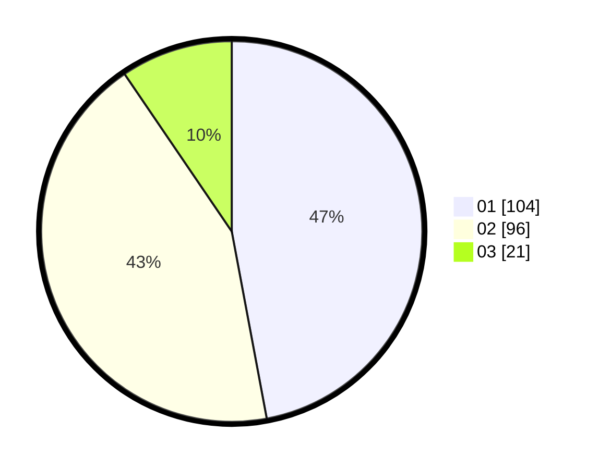

# Hasil

Hasil perolehan suara paslon dapat dilihat pada file paslon-01.txt, paslon-02.txt, dan paslon-03.txt.

Jika tidak ada, artinya data tersebut belum ada pada SIREKAP.

## Perolehan Suara

 * Paslon 01: **104**.
 * Paslon 02: **96**.
 * Paslon 03: **21**.

## Foto C Plano

https://sirekap-obj-formc.kpu.go.id/55ed/pemilu/ppwp/31/72/06/10/03/3172061003064-20240214-234019--585e2142-aeb9-40b0-af0e-871890be387b.jpg

https://sirekap-obj-formc.kpu.go.id/55ed/pemilu/ppwp/31/72/06/10/03/3172061003064-20240214-214143--59ab5ec0-3a8f-4eaf-8da9-d9078a7dc3d1.jpg

https://sirekap-obj-formc.kpu.go.id/55ed/pemilu/ppwp/31/72/06/10/03/3172061003064-20240214-201542--c1542348-643b-4059-a7a8-bbc00ecf9b19.jpg
