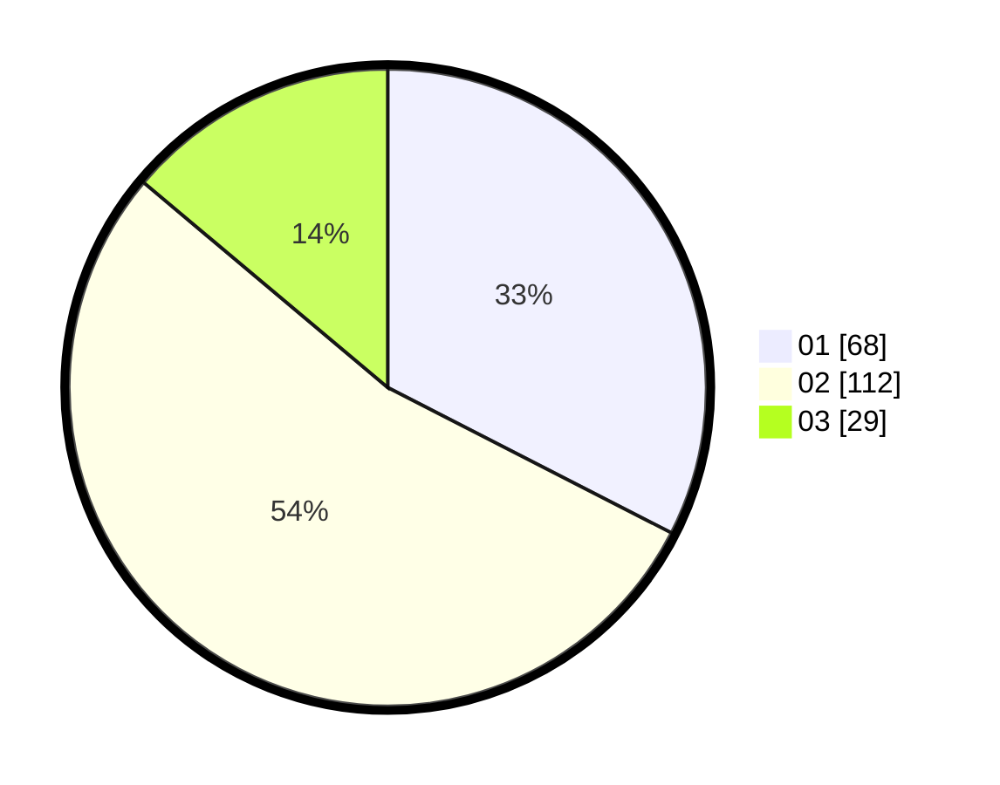

# Hasil

Hasil perolehan suara paslon dapat dilihat pada file paslon-01.txt, paslon-02.txt, dan paslon-03.txt.

Jika tidak ada, artinya data tersebut belum ada pada SIREKAP.

## Perolehan Suara

 * Paslon 01: **68**.
 * Paslon 02: **112**.
 * Paslon 03: **29**.

## Foto C Plano

https://sirekap-obj-formc.kpu.go.id/ca28/pemilu/ppwp/31/72/06/10/03/3172061003066-20240214-201345--2e5342c9-0f7a-4ec7-b810-f3cb0d0d9a93.jpg

https://sirekap-obj-formc.kpu.go.id/ca28/pemilu/ppwp/31/72/06/10/03/3172061003066-20240214-194427--9adc8356-b98f-4d01-8f93-f8e8d961a9b4.jpg

https://sirekap-obj-formc.kpu.go.id/ca28/pemilu/ppwp/31/72/06/10/03/3172061003066-20240214-194624--c93d49f1-3506-4c42-a455-d9dfb59027b9.jpg

## DATA PEMILIH TETAP

Jumlah pemilih dalam DPT: **285**.
 * L: **131**.
 * P: **154**.

## DATA PENGGUNA HAK PILIH

Jumlah pengguna hak pilih dalam DPT: **199**.
 * L: **84**.
 * P: **115**.

Jumlah pengguna hak pilih dalam DPTb: **8**.
 * L: **3**.
 * P: **5**.

Jumlah pengguna hak pilih dalam DPK: **3**.
 * L: **0**.
 * P: **3**.

Jumlah pengguna hak pilih: **210**.
 * L: **87**.
 * P: **123**.

## JUMLAH SUARA SAH DAN TIDAK SAH

JUMLAH SELURUH SUARA SAH: **209**.

JUMLAH SUARA TIDAK SAH: **1**.

JUMLAH SELURUH SUARA SAH DAN SUARA TIDAK SAH: **210**.
