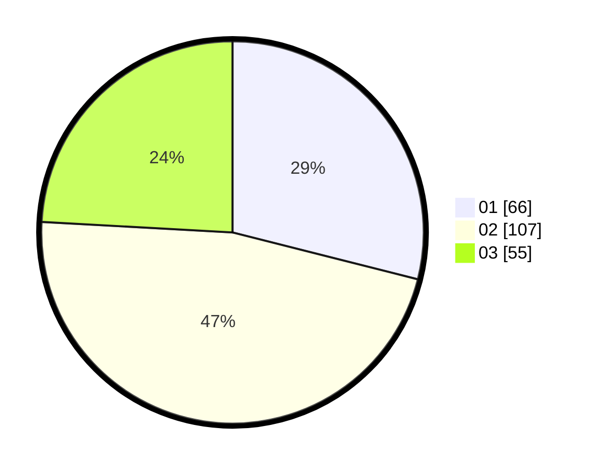

# Hasil

Hasil perolehan suara paslon dapat dilihat pada file paslon-01.txt, paslon-02.txt, dan paslon-03.txt.

Jika tidak ada, artinya data tersebut belum ada pada SIREKAP.

## Perolehan Suara

 * Paslon 01: **66**.
 * Paslon 02: **107**.
 * Paslon 03: **55**.

## Foto C Plano

https://sirekap-obj-formc.kpu.go.id/3974/pemilu/ppwp/31/72/06/10/03/3172061003067-20240216-232151--e5633885-5acc-4e4c-b2a4-5b9fe3d778ca.jpg

https://sirekap-obj-formc.kpu.go.id/3974/pemilu/ppwp/31/72/06/10/03/3172061003067-20240216-232152--50ba54e6-fad8-4230-a90d-9f8ecf13b203.jpg

https://sirekap-obj-formc.kpu.go.id/3974/pemilu/ppwp/31/72/06/10/03/3172061003067-20240216-232152--c4916615-3894-4885-89a5-cc4947c20392.jpg

## DATA PEMILIH TETAP

Jumlah pemilih dalam DPT: **293**.
 * L: **136**.
 * P: **157**.

## DATA PENGGUNA HAK PILIH

Jumlah pengguna hak pilih dalam DPT: **219**.
 * L: **96**.
 * P: **123**.

Jumlah pengguna hak pilih dalam DPTb: **6**.
 * L: **2**.
 * P: **4**.

Jumlah pengguna hak pilih dalam DPK: **7**.
 * L: **6**.
 * P: **1**.

Jumlah pengguna hak pilih: **232**.
 * L: **104**.
 * P: **128**.

## JUMLAH SUARA SAH DAN TIDAK SAH

JUMLAH SELURUH SUARA SAH: **228**.

JUMLAH SUARA TIDAK SAH: **4**.

JUMLAH SELURUH SUARA SAH DAN SUARA TIDAK SAH: **232**.
