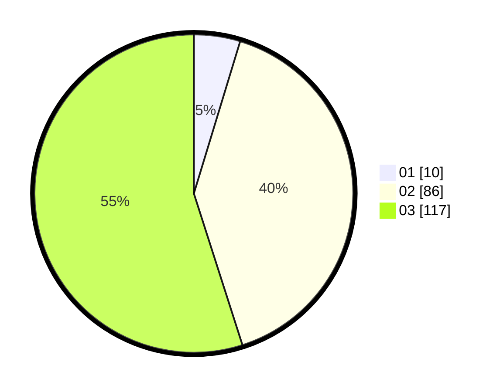

# Hasil

Hasil perolehan suara paslon dapat dilihat pada file paslon-01.txt, paslon-02.txt, dan paslon-03.txt.

Jika tidak ada, artinya data tersebut belum ada pada SIREKAP.

## Perolehan Suara

 * Paslon 01: **10**.
 * Paslon 02: **86**.
 * Paslon 03: **117**.

## Foto C Plano

https://sirekap-obj-formc.kpu.go.id/d58b/pemilu/ppwp/31/72/06/10/03/3172061003070-20240217-164106--a344b3c2-88ec-4d0c-8276-205ba343f277.jpg

https://sirekap-obj-formc.kpu.go.id/d58b/pemilu/ppwp/31/72/06/10/03/3172061003070-20240217-164108--90bc97fa-f3d5-4fa7-85b7-1d5194aa0ad2.jpg

https://sirekap-obj-formc.kpu.go.id/d58b/pemilu/ppwp/31/72/06/10/03/3172061003070-20240217-164107--95a00773-8765-42ce-9ba6-c912bbc75b79.jpg

## DATA PEMILIH TETAP

Jumlah pemilih dalam DPT: **300**.
 * L: **140**.
 * P: **160**.

## DATA PENGGUNA HAK PILIH

Jumlah pengguna hak pilih dalam DPT: **200**.
 * L: **92**.
 * P: **108**.

Jumlah pengguna hak pilih dalam DPTb: **9**.
 * L: **1**.
 * P: **8**.

Jumlah pengguna hak pilih dalam DPK: **5**.
 * L: **3**.
 * P: **2**.

Jumlah pengguna hak pilih: **214**.
 * L: **96**.
 * P: **118**.

## JUMLAH SUARA SAH DAN TIDAK SAH

JUMLAH SELURUH SUARA SAH: **213**.

JUMLAH SUARA TIDAK SAH: **1**.

JUMLAH SELURUH SUARA SAH DAN SUARA TIDAK SAH: **214**.
