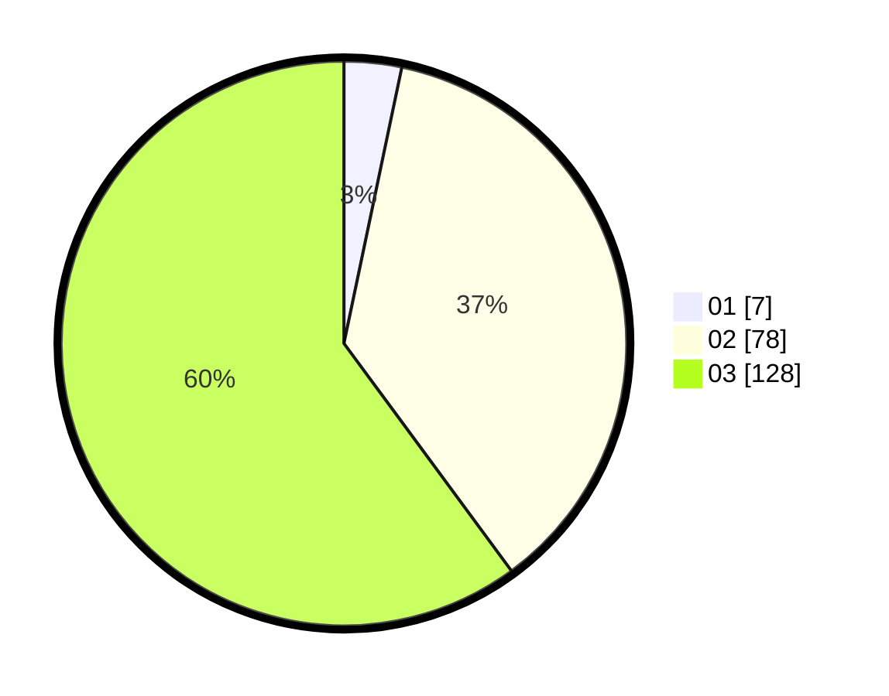

# Hasil

Hasil perolehan suara paslon dapat dilihat pada file paslon-01.txt, paslon-02.txt, dan paslon-03.txt.

Jika tidak ada, artinya data tersebut belum ada pada SIREKAP.

## Perolehan Suara

 * Paslon 01: **7**.
 * Paslon 02: **78**.
 * Paslon 03: **128**.

## Foto C Plano

https://sirekap-obj-formc.kpu.go.id/fefd/pemilu/ppwp/31/72/06/10/03/3172061003077-20240215-130523--4a4f4d15-3687-4214-81df-ca417e91871b.jpg

https://sirekap-obj-formc.kpu.go.id/fefd/pemilu/ppwp/31/72/06/10/03/3172061003077-20240214-214412--e29be99f-2b0d-492b-931f-7b21c79806e9.jpg

https://sirekap-obj-formc.kpu.go.id/fefd/pemilu/ppwp/31/72/06/10/03/3172061003077-20240214-214439--d856f1b0-5f3f-4487-8dc8-c892e8b8f157.jpg

## DATA PEMILIH TETAP

Jumlah pemilih dalam DPT: **289**.
 * L: **142**.
 * P: **147**.

## DATA PENGGUNA HAK PILIH

Jumlah pengguna hak pilih dalam DPT: **197**.
 * L: **95**.
 * P: **102**.

Jumlah pengguna hak pilih dalam DPTb: **16**.
 * L: **6**.
 * P: **10**.

Jumlah pengguna hak pilih dalam DPK: **2**.
 * L: **1**.
 * P: **1**.

Jumlah pengguna hak pilih: **215**.
 * L: **102**.
 * P: **113**.

## JUMLAH SUARA SAH DAN TIDAK SAH

JUMLAH SELURUH SUARA SAH: **213**.

JUMLAH SUARA TIDAK SAH: **2**.

JUMLAH SELURUH SUARA SAH DAN SUARA TIDAK SAH: **215**.
