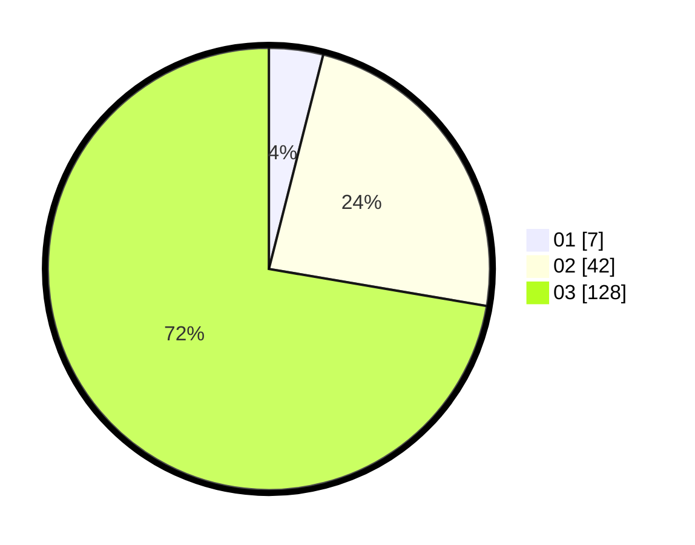

# Hasil

Hasil perolehan suara paslon dapat dilihat pada file paslon-01.txt, paslon-02.txt, dan paslon-03.txt.

Jika tidak ada, artinya data tersebut belum ada pada SIREKAP.

## Perolehan Suara

 * Paslon 01: **7**.
 * Paslon 02: **42**.
 * Paslon 03: **128**.

## Foto C Plano

https://sirekap-obj-formc.kpu.go.id/2276/pemilu/ppwp/31/72/06/10/03/3172061003078-20240219-145727--bd327bce-3fe5-411a-bace-39d2f134ebf7.jpg

https://sirekap-obj-formc.kpu.go.id/2276/pemilu/ppwp/31/72/06/10/03/3172061003078-20240219-145728--76404d87-2e79-4868-b147-d7edf94f8c0d.jpg

https://sirekap-obj-formc.kpu.go.id/2276/pemilu/ppwp/31/72/06/10/03/3172061003078-20240219-145728--84780c6c-52e2-42dd-b25a-a833033cc5f5.jpg

## DATA PEMILIH TETAP

Jumlah pemilih dalam DPT: **237**.
 * L: **108**.
 * P: **129**.

## DATA PENGGUNA HAK PILIH

Jumlah pengguna hak pilih dalam DPT: **165**.
 * L: **73**.
 * P: **92**.

Jumlah pengguna hak pilih dalam DPTb: **9**.
 * L: **6**.
 * P: **3**.

Jumlah pengguna hak pilih dalam DPK: **8**.
 * L: **2**.
 * P: **6**.

Jumlah pengguna hak pilih: **182**.
 * L: **81**.
 * P: **101**.

## JUMLAH SUARA SAH DAN TIDAK SAH

JUMLAH SELURUH SUARA SAH: **177**.

JUMLAH SUARA TIDAK SAH: **5**.

JUMLAH SELURUH SUARA SAH DAN SUARA TIDAK SAH: **182**.
