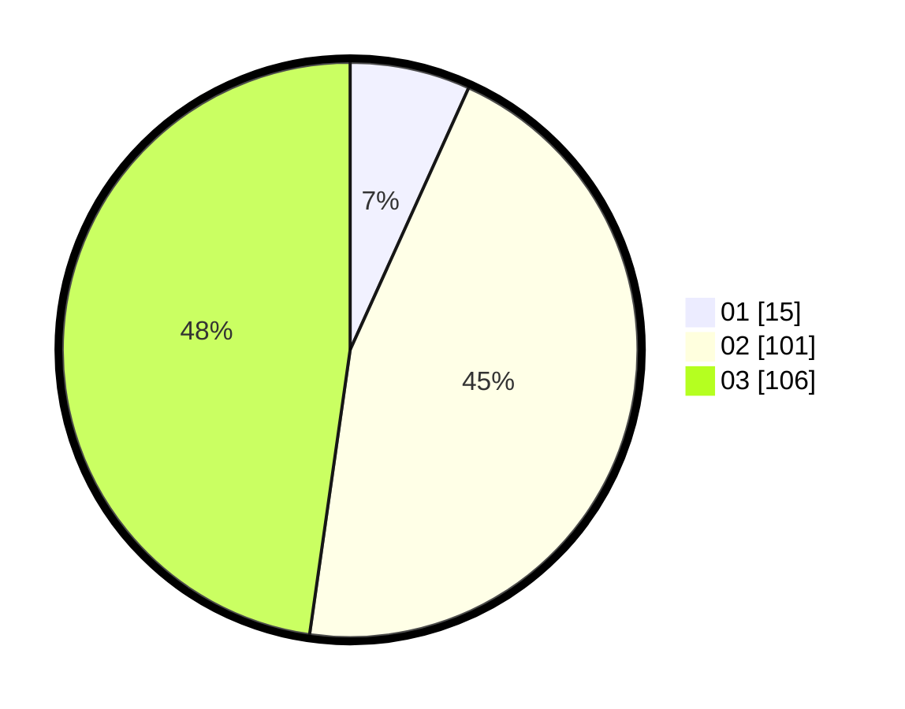

# Hasil

Hasil perolehan suara paslon dapat dilihat pada file paslon-01.txt, paslon-02.txt, dan paslon-03.txt.

Jika tidak ada, artinya data tersebut belum ada pada SIREKAP.

## Perolehan Suara

 * Paslon 01: **15**.
 * Paslon 02: **101**.
 * Paslon 03: **106**.

## Foto C Plano

https://sirekap-obj-formc.kpu.go.id/9f06/pemilu/ppwp/31/72/06/10/03/3172061003089-20240214-201055--6b3a9d34-509d-4f83-9c4c-cd81e7d1bd88.jpg

https://sirekap-obj-formc.kpu.go.id/9f06/pemilu/ppwp/31/72/06/10/03/3172061003089-20240214-201124--e398ea84-5fc2-41d9-a292-c3c85024c51e.jpg

https://sirekap-obj-formc.kpu.go.id/9f06/pemilu/ppwp/31/72/06/10/03/3172061003089-20240214-203831--130d5ef4-e7c3-46ed-8d2d-c720ff5cbf01.jpg

## DATA PEMILIH TETAP

Jumlah pemilih dalam DPT: **281**.
 * L: **136**.
 * P: **145**.

## DATA PENGGUNA HAK PILIH

Jumlah pengguna hak pilih dalam DPT: **199**.
 * L: **93**.
 * P: **106**.

Jumlah pengguna hak pilih dalam DPTb: **17**.
 * L: **6**.
 * P: **11**.

Jumlah pengguna hak pilih dalam DPK: **8**.
 * L: **3**.
 * P: **5**.

Jumlah pengguna hak pilih: **224**.
 * L: **102**.
 * P: **122**.

## JUMLAH SUARA SAH DAN TIDAK SAH

JUMLAH SELURUH SUARA SAH: **222**.

JUMLAH SUARA TIDAK SAH: **2**.

JUMLAH SELURUH SUARA SAH DAN SUARA TIDAK SAH: **224**.
