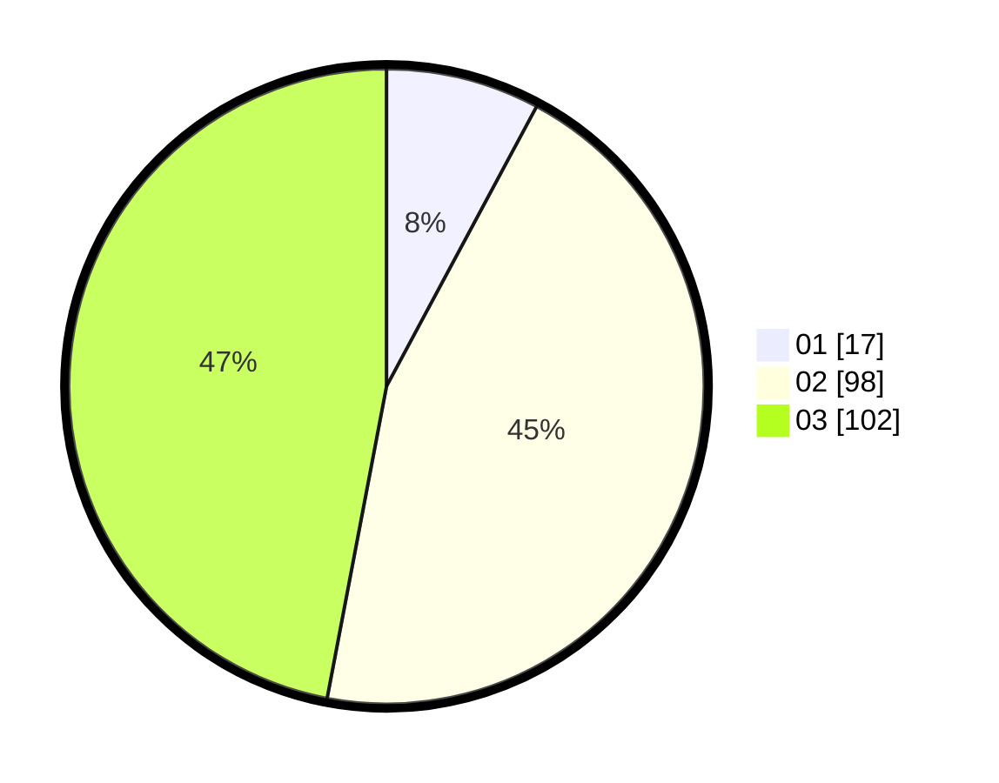

# Hasil

Hasil perolehan suara paslon dapat dilihat pada file paslon-01.txt, paslon-02.txt, dan paslon-03.txt.

Jika tidak ada, artinya data tersebut belum ada pada SIREKAP.

## Perolehan Suara

 * Paslon 01: **17**.
 * Paslon 02: **98**.
 * Paslon 03: **102**.

## Foto C Plano

https://sirekap-obj-formc.kpu.go.id/7add/pemilu/ppwp/31/72/06/10/03/3172061003090-20240216-130746--cc3c01a8-f595-41c5-bdf0-48ef8a72b536.jpg

https://sirekap-obj-formc.kpu.go.id/7add/pemilu/ppwp/31/72/06/10/03/3172061003090-20240215-054554--7f6e50f6-b54c-49c2-930c-03368324a3c2.jpg

https://sirekap-obj-formc.kpu.go.id/7add/pemilu/ppwp/31/72/06/10/03/3172061003090-20240215-054652--f108e530-7b80-46b5-b308-9ea7e79e1b2e.jpg

## DATA PEMILIH TETAP

Jumlah pemilih dalam DPT: **289**.
 * L: **122**.
 * P: **167**.

## DATA PENGGUNA HAK PILIH

Jumlah pengguna hak pilih dalam DPT: **193**.
 * L: **84**.
 * P: **109**.

Jumlah pengguna hak pilih dalam DPTb: **16**.
 * L: **7**.
 * P: **9**.

Jumlah pengguna hak pilih dalam DPK: **8**.
 * L: **4**.
 * P: **4**.

Jumlah pengguna hak pilih: **217**.
 * L: **95**.
 * P: **122**.

## JUMLAH SUARA SAH DAN TIDAK SAH

JUMLAH SELURUH SUARA SAH: **217**.

JUMLAH SUARA TIDAK SAH: **0**.

JUMLAH SELURUH SUARA SAH DAN SUARA TIDAK SAH: **217**.
