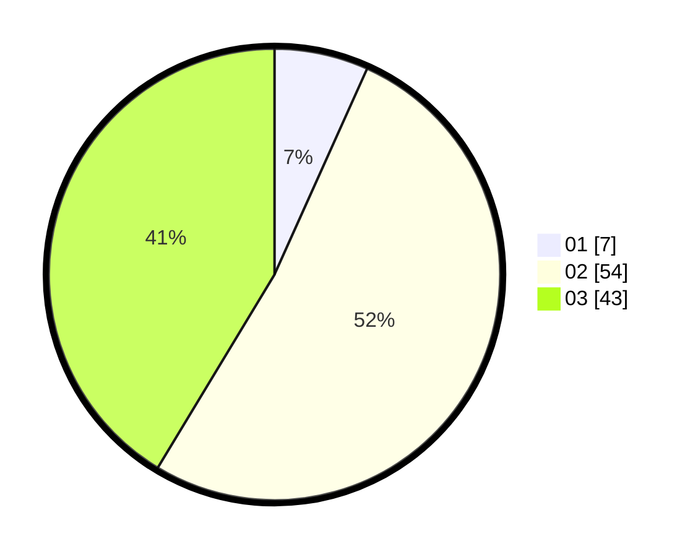

# Hasil

Hasil perolehan suara paslon dapat dilihat pada file paslon-01.txt, paslon-02.txt, dan paslon-03.txt.

Jika tidak ada, artinya data tersebut belum ada pada SIREKAP.

## Perolehan Suara

 * Paslon 01: **7**.
 * Paslon 02: **54**.
 * Paslon 03: **43**.

## Foto C Plano

https://sirekap-obj-formc.kpu.go.id/b2b6/pemilu/ppwp/31/72/06/10/03/3172061003091-20240214-195310--86e3e140-9191-40aa-aa08-494574651b1d.jpg

https://sirekap-obj-formc.kpu.go.id/b2b6/pemilu/ppwp/31/72/06/10/03/3172061003091-20240214-204116--ee01a021-1048-490e-bf7b-279c43f23071.jpg

https://sirekap-obj-formc.kpu.go.id/b2b6/pemilu/ppwp/31/72/06/10/03/3172061003091-20240214-195221--7eb17b7c-8e16-43f8-9897-d4c84f50a8b4.jpg

## DATA PEMILIH TETAP

Jumlah pemilih dalam DPT: **141**.
 * L: **69**.
 * P: **72**.

## DATA PENGGUNA HAK PILIH

Jumlah pengguna hak pilih dalam DPT: **86**.
 * L: **43**.
 * P: **43**.

Jumlah pengguna hak pilih dalam DPTb: **9**.
 * L: **8**.
 * P: **1**.

Jumlah pengguna hak pilih dalam DPK: **10**.
 * L: **4**.
 * P: **6**.

Jumlah pengguna hak pilih: **105**.
 * L: **55**.
 * P: **50**.

## JUMLAH SUARA SAH DAN TIDAK SAH

JUMLAH SELURUH SUARA SAH: **104**.

JUMLAH SUARA TIDAK SAH: **1**.

JUMLAH SELURUH SUARA SAH DAN SUARA TIDAK SAH: **105**.
