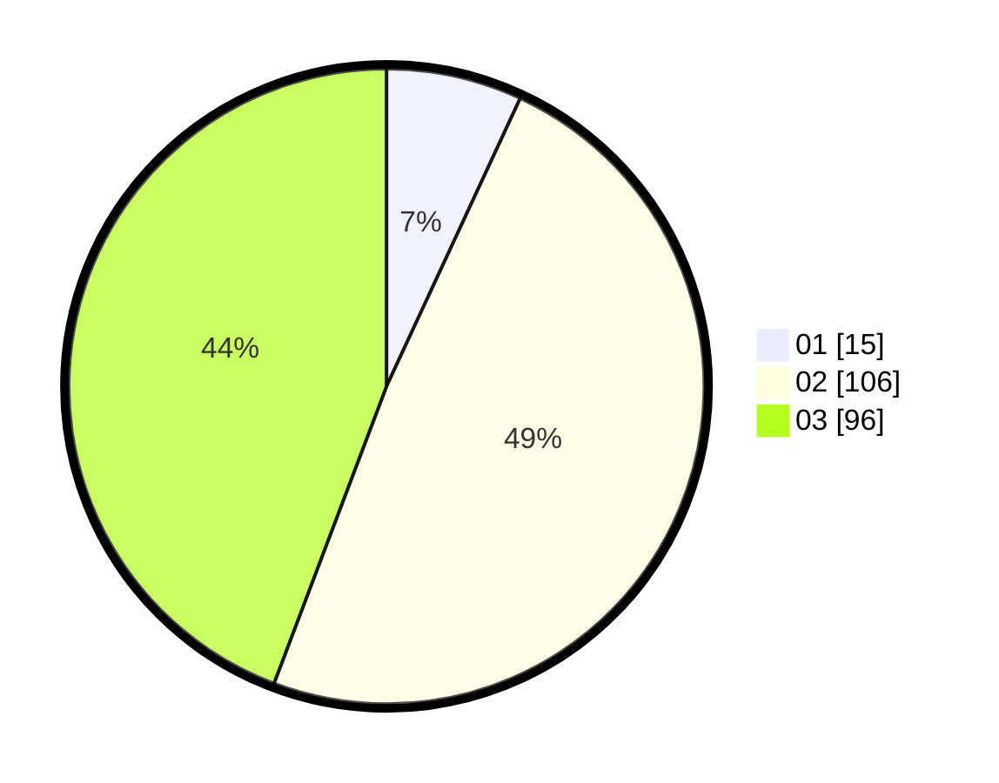

# Hasil

Hasil perolehan suara paslon dapat dilihat pada file paslon-01.txt, paslon-02.txt, dan paslon-03.txt.

Jika tidak ada, artinya data tersebut belum ada pada SIREKAP.

## Perolehan Suara

 * Paslon 01: **15**.
 * Paslon 02: **106**.
 * Paslon 03: **96**.

## Foto C Plano

https://sirekap-obj-formc.kpu.go.id/e205/pemilu/ppwp/31/72/06/10/03/3172061003092-20240214-215114--f9798b4b-5243-412a-b1c9-f4cdef6fa48f.jpg

https://sirekap-obj-formc.kpu.go.id/e205/pemilu/ppwp/31/72/06/10/03/3172061003092-20240214-215223--01489db7-a32a-488e-8f84-109dc9775616.jpg

https://sirekap-obj-formc.kpu.go.id/e205/pemilu/ppwp/31/72/06/10/03/3172061003092-20240214-215612--5877e0f2-bf96-4844-9b7f-04d455c102a8.jpg

## DATA PEMILIH TETAP

Jumlah pemilih dalam DPT: **294**.
 * L: **142**.
 * P: **152**.

## DATA PENGGUNA HAK PILIH

Jumlah pengguna hak pilih dalam DPT: **188**.
 * L: **85**.
 * P: **103**.

Jumlah pengguna hak pilih dalam DPTb: **17**.
 * L: **6**.
 * P: **11**.

Jumlah pengguna hak pilih dalam DPK: **13**.
 * L: **7**.
 * P: **6**.

Jumlah pengguna hak pilih: **218**.
 * L: **98**.
 * P: **120**.

## JUMLAH SUARA SAH DAN TIDAK SAH

JUMLAH SELURUH SUARA SAH: **217**.

JUMLAH SUARA TIDAK SAH: **1**.

JUMLAH SELURUH SUARA SAH DAN SUARA TIDAK SAH: **218**.
