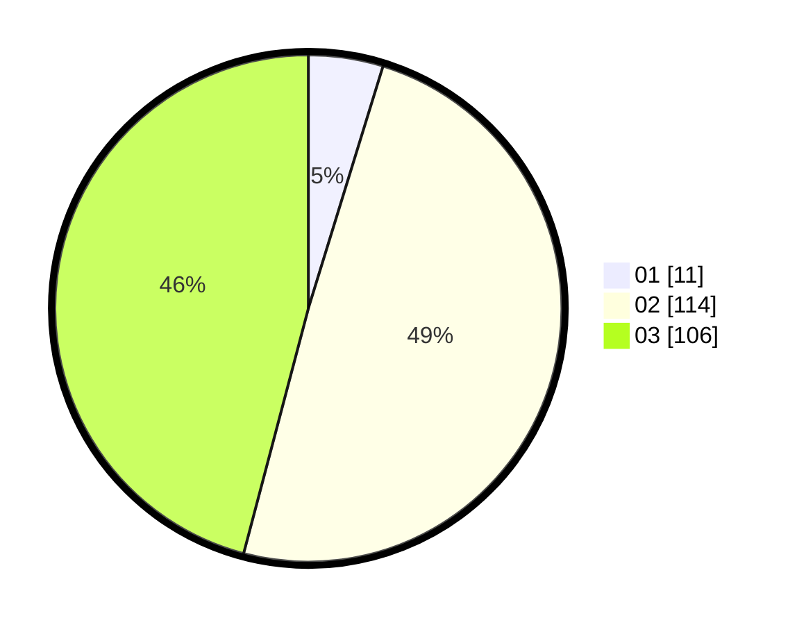

# Hasil

Hasil perolehan suara paslon dapat dilihat pada file paslon-01.txt, paslon-02.txt, dan paslon-03.txt.

Jika tidak ada, artinya data tersebut belum ada pada SIREKAP.

## Perolehan Suara

 * Paslon 01: **11**.
 * Paslon 02: **114**.
 * Paslon 03: **106**.

## Foto C Plano

https://sirekap-obj-formc.kpu.go.id/1922/pemilu/ppwp/31/72/06/10/03/3172061003093-20240217-002346--4cf262ad-7a74-4417-a890-1e5e860d2f0d.jpg

https://sirekap-obj-formc.kpu.go.id/1922/pemilu/ppwp/31/72/06/10/03/3172061003093-20240215-125346--9fcc7549-f55a-4a81-a940-88c646dce9c4.jpg

https://sirekap-obj-formc.kpu.go.id/1922/pemilu/ppwp/31/72/06/10/03/3172061003093-20240217-002347--2ed0f643-4959-4392-801c-439a46cfe48c.jpg

## DATA PEMILIH TETAP

Jumlah pemilih dalam DPT: **295**.
 * L: **124**.
 * P: **171**.

## DATA PENGGUNA HAK PILIH

Jumlah pengguna hak pilih dalam DPT: **202**.
 * L: **86**.
 * P: **116**.

Jumlah pengguna hak pilih dalam DPTb: **24**.
 * L: **14**.
 * P: **10**.

Jumlah pengguna hak pilih dalam DPK: **9**.
 * L: **5**.
 * P: **4**.

Jumlah pengguna hak pilih: **235**.
 * L: **105**.
 * P: **130**.

## JUMLAH SUARA SAH DAN TIDAK SAH

JUMLAH SELURUH SUARA SAH: **231**.

JUMLAH SUARA TIDAK SAH: **4**.

JUMLAH SELURUH SUARA SAH DAN SUARA TIDAK SAH: **235**.
