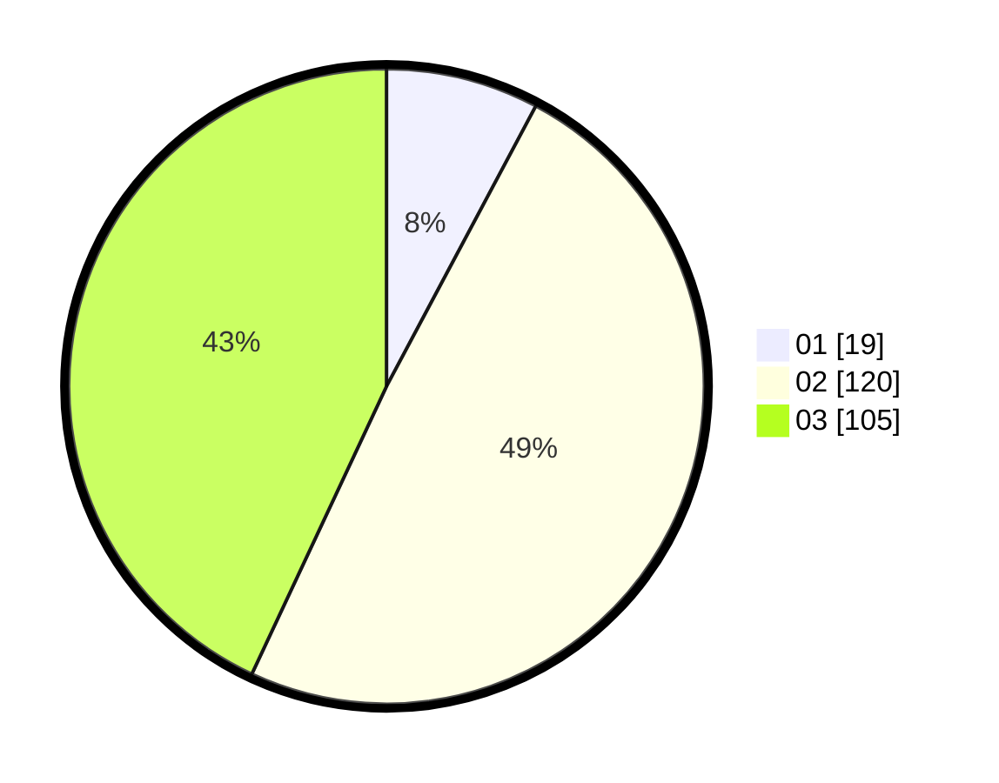

# Hasil

Hasil perolehan suara paslon dapat dilihat pada file paslon-01.txt, paslon-02.txt, dan paslon-03.txt.

Jika tidak ada, artinya data tersebut belum ada pada SIREKAP.

## Perolehan Suara

 * Paslon 01: **19**.
 * Paslon 02: **120**.
 * Paslon 03: **105**.

## Foto C Plano

https://sirekap-obj-formc.kpu.go.id/10e7/pemilu/ppwp/31/72/06/10/03/3172061003097-20240214-155209--d23127b0-428a-4360-ae56-efe9eb9df30d.jpg

https://sirekap-obj-formc.kpu.go.id/10e7/pemilu/ppwp/31/72/06/10/03/3172061003097-20240214-155310--6f48f5a0-32cc-4d9a-9d34-d6def3bb7025.jpg

https://sirekap-obj-formc.kpu.go.id/10e7/pemilu/ppwp/31/72/06/10/03/3172061003097-20240214-155438--13065b67-7889-4dfd-970c-6b5757af791c.jpg

## DATA PEMILIH TETAP

Jumlah pemilih dalam DPT: **291**.
 * L: **127**.
 * P: **164**.

## DATA PENGGUNA HAK PILIH

Jumlah pengguna hak pilih dalam DPT: **213**.
 * L: **97**.
 * P: **116**.

Jumlah pengguna hak pilih dalam DPTb: **22**.
 * L: **14**.
 * P: **8**.

Jumlah pengguna hak pilih dalam DPK: **11**.
 * L: **4**.
 * P: **7**.

Jumlah pengguna hak pilih: **246**.
 * L: **115**.
 * P: **131**.

## JUMLAH SUARA SAH DAN TIDAK SAH

JUMLAH SELURUH SUARA SAH: **244**.

JUMLAH SUARA TIDAK SAH: **2**.

JUMLAH SELURUH SUARA SAH DAN SUARA TIDAK SAH: **246**.
