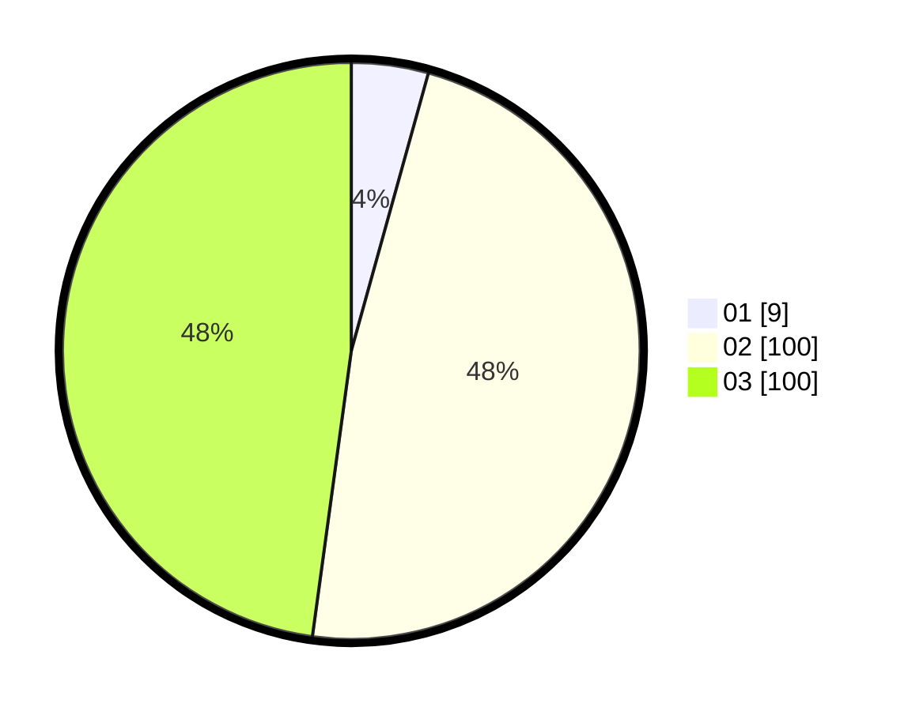

# Hasil

Hasil perolehan suara paslon dapat dilihat pada file paslon-01.txt, paslon-02.txt, dan paslon-03.txt.

Jika tidak ada, artinya data tersebut belum ada pada SIREKAP.

## Perolehan Suara

 * Paslon 01: **9**.
 * Paslon 02: **100**.
 * Paslon 03: **100**.

## Foto C Plano

https://sirekap-obj-formc.kpu.go.id/bd18/pemilu/ppwp/31/72/06/10/03/3172061003098-20240214-204924--491770e0-0fd8-4481-8014-c3c5b7210f16.jpg

https://sirekap-obj-formc.kpu.go.id/bd18/pemilu/ppwp/31/72/06/10/03/3172061003098-20240214-205246--9319b32d-387c-4a42-aa86-8ab34bc7622b.jpg

https://sirekap-obj-formc.kpu.go.id/bd18/pemilu/ppwp/31/72/06/10/03/3172061003098-20240216-051119--4a6d70ae-5278-44cd-8bec-2ea60db75ec2.jpg

## DATA PEMILIH TETAP

Jumlah pemilih dalam DPT: **281**.
 * L: **119**.
 * P: **162**.

## DATA PENGGUNA HAK PILIH

Jumlah pengguna hak pilih dalam DPT: **185**.
 * L: **80**.
 * P: **105**.

Jumlah pengguna hak pilih dalam DPTb: **20**.
 * L: **10**.
 * P: **10**.

Jumlah pengguna hak pilih dalam DPK: **5**.
 * L: **2**.
 * P: **3**.

Jumlah pengguna hak pilih: **210**.
 * L: **92**.
 * P: **118**.

## JUMLAH SUARA SAH DAN TIDAK SAH

JUMLAH SELURUH SUARA SAH: **209**.

JUMLAH SUARA TIDAK SAH: **1**.

JUMLAH SELURUH SUARA SAH DAN SUARA TIDAK SAH: **210**.
