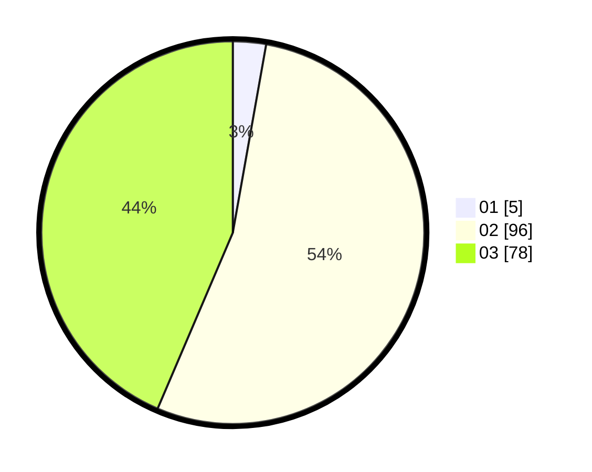

# Hasil

Hasil perolehan suara paslon dapat dilihat pada file paslon-01.txt, paslon-02.txt, dan paslon-03.txt.

Jika tidak ada, artinya data tersebut belum ada pada SIREKAP.

## Perolehan Suara

 * Paslon 01: **5**.
 * Paslon 02: **96**.
 * Paslon 03: **78**.

## Foto C Plano

https://sirekap-obj-formc.kpu.go.id/e184/pemilu/ppwp/31/72/06/10/03/3172061003099-20240214-155433--af6a2b92-cbaa-41a3-a2da-2cd56a5bab64.jpg

https://sirekap-obj-formc.kpu.go.id/e184/pemilu/ppwp/31/72/06/10/03/3172061003099-20240214-155504--e820b0e7-4406-438e-961b-c1ae41c806b8.jpg

https://sirekap-obj-formc.kpu.go.id/e184/pemilu/ppwp/31/72/06/10/03/3172061003099-20240214-155520--cf70e3e0-179d-470f-a26e-f7ac9dd5d0b2.jpg

## DATA PEMILIH TETAP

Jumlah pemilih dalam DPT: **247**.
 * L: **125**.
 * P: **122**.

## DATA PENGGUNA HAK PILIH

Jumlah pengguna hak pilih dalam DPT: **171**.
 * L: **86**.
 * P: **85**.

Jumlah pengguna hak pilih dalam DPTb: **10**.
 * L: **6**.
 * P: **4**.

Jumlah pengguna hak pilih dalam DPK: **1**.
 * L: **1**.
 * P: **0**.

Jumlah pengguna hak pilih: **182**.
 * L: **93**.
 * P: **89**.

## JUMLAH SUARA SAH DAN TIDAK SAH

JUMLAH SELURUH SUARA SAH: **179**.

JUMLAH SUARA TIDAK SAH: **3**.

JUMLAH SELURUH SUARA SAH DAN SUARA TIDAK SAH: **182**.
