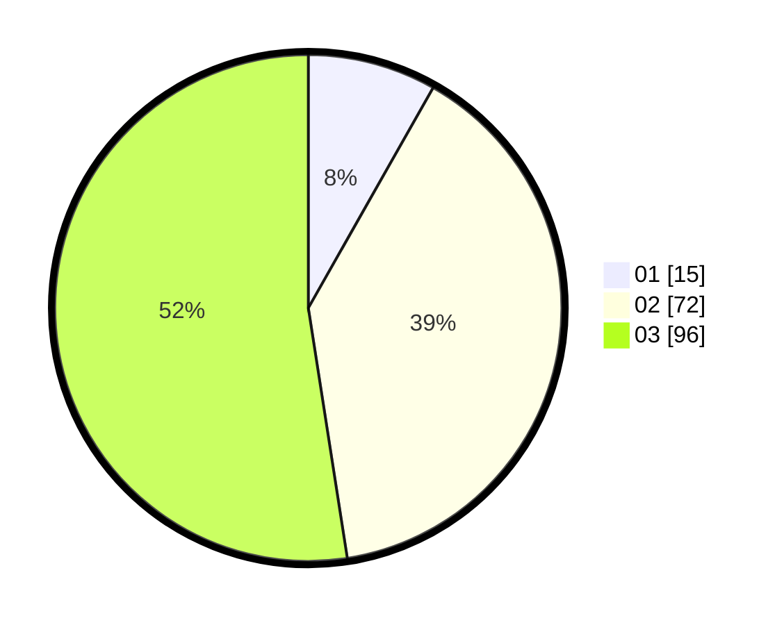

# Hasil

Hasil perolehan suara paslon dapat dilihat pada file paslon-01.txt, paslon-02.txt, dan paslon-03.txt.

Jika tidak ada, artinya data tersebut belum ada pada SIREKAP.

## Perolehan Suara

 * Paslon 01: **15**.
 * Paslon 02: **72**.
 * Paslon 03: **96**.

## Foto C Plano

https://sirekap-obj-formc.kpu.go.id/6410/pemilu/ppwp/31/72/06/10/03/3172061003100-20240214-220611--5dae23f9-5b02-43a0-bad4-d9df50560391.jpg

https://sirekap-obj-formc.kpu.go.id/6410/pemilu/ppwp/31/72/06/10/03/3172061003100-20240214-220704--227961ff-5ece-42e7-801a-5d04fa099124.jpg

https://sirekap-obj-formc.kpu.go.id/6410/pemilu/ppwp/31/72/06/10/03/3172061003100-20240214-220930--772598d4-d960-40fa-922b-f4c5bdc42b7f.jpg

## DATA PEMILIH TETAP

Jumlah pemilih dalam DPT: **162**.
 * L: **82**.
 * P: **80**.

## DATA PENGGUNA HAK PILIH

Jumlah pengguna hak pilih dalam DPT: **162**.
 * L: **82**.
 * P: **80**.

Jumlah pengguna hak pilih dalam DPTb: **15**.
 * L: **4**.
 * P: **11**.

Jumlah pengguna hak pilih dalam DPK: **8**.
 * L: **3**.
 * P: **5**.

Jumlah pengguna hak pilih: **185**.
 * L: **89**.
 * P: **96**.

## JUMLAH SUARA SAH DAN TIDAK SAH

JUMLAH SELURUH SUARA SAH: **183**.

JUMLAH SUARA TIDAK SAH: **2**.

JUMLAH SELURUH SUARA SAH DAN SUARA TIDAK SAH: **185**.
