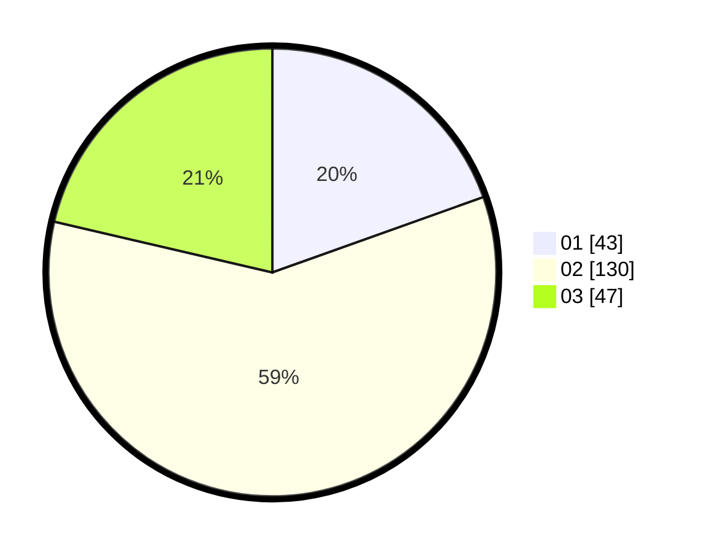

# Hasil

Hasil perolehan suara paslon dapat dilihat pada file paslon-01.txt, paslon-02.txt, dan paslon-03.txt.

Jika tidak ada, artinya data tersebut belum ada pada SIREKAP.

## Perolehan Suara

 * Paslon 01: **43**.
 * Paslon 02: **130**.
 * Paslon 03: **47**.

## Foto C Plano

https://sirekap-obj-formc.kpu.go.id/e4e9/pemilu/ppwp/31/72/06/10/03/3172061003104-20240216-205143--1c876703-8077-46bb-b3ae-01f706e3c234.jpg

https://sirekap-obj-formc.kpu.go.id/e4e9/pemilu/ppwp/31/72/06/10/03/3172061003104-20240214-213144--6884a57b-a688-4ede-af44-52581b02460e.jpg

https://sirekap-obj-formc.kpu.go.id/e4e9/pemilu/ppwp/31/72/06/10/03/3172061003104-20240214-213334--d82da31b-4dca-4f39-8cc3-b5a013ba9c98.jpg

## DATA PEMILIH TETAP

Jumlah pemilih dalam DPT: **288**.
 * L: **145**.
 * P: **143**.

## DATA PENGGUNA HAK PILIH

Jumlah pengguna hak pilih dalam DPT: **212**.
 * L: **103**.
 * P: **109**.

Jumlah pengguna hak pilih dalam DPTb: **4**.
 * L: **2**.
 * P: **2**.

Jumlah pengguna hak pilih dalam DPK: **10**.
 * L: **5**.
 * P: **5**.

Jumlah pengguna hak pilih: **226**.
 * L: **110**.
 * P: **116**.

## JUMLAH SUARA SAH DAN TIDAK SAH

JUMLAH SELURUH SUARA SAH: **226**.

JUMLAH SUARA TIDAK SAH: **2**.

JUMLAH SELURUH SUARA SAH DAN SUARA TIDAK SAH: **228**.
