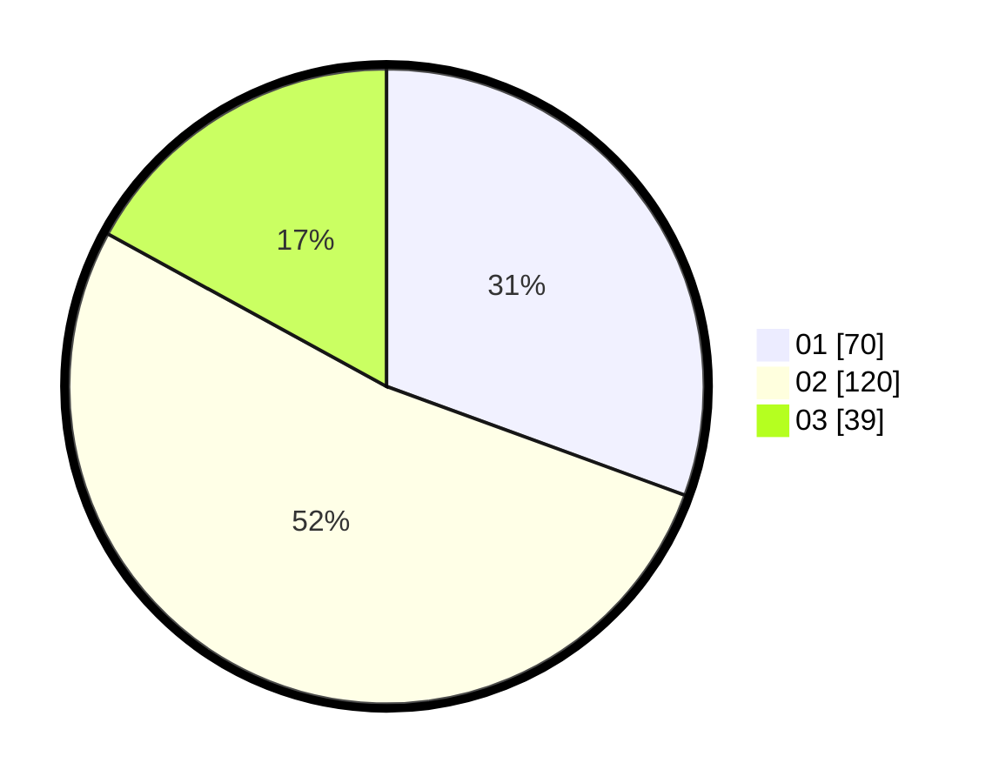

# Hasil

Hasil perolehan suara paslon dapat dilihat pada file paslon-01.txt, paslon-02.txt, dan paslon-03.txt.

Jika tidak ada, artinya data tersebut belum ada pada SIREKAP.

## Perolehan Suara

 * Paslon 01: **70**.
 * Paslon 02: **120**.
 * Paslon 03: **39**.

## Foto C Plano

https://sirekap-obj-formc.kpu.go.id/fc02/pemilu/ppwp/31/72/06/10/03/3172061003106-20240214-223743--4220dc02-7a4f-4d99-a830-46799436f517.jpg

https://sirekap-obj-formc.kpu.go.id/fc02/pemilu/ppwp/31/72/06/10/03/3172061003106-20240214-223845--983cfb34-eaef-475a-ba8f-4caded8d9566.jpg

https://sirekap-obj-formc.kpu.go.id/fc02/pemilu/ppwp/31/72/06/10/03/3172061003106-20240214-224002--1778d6e3-cef6-4587-8930-dd7c5e0a3f95.jpg
