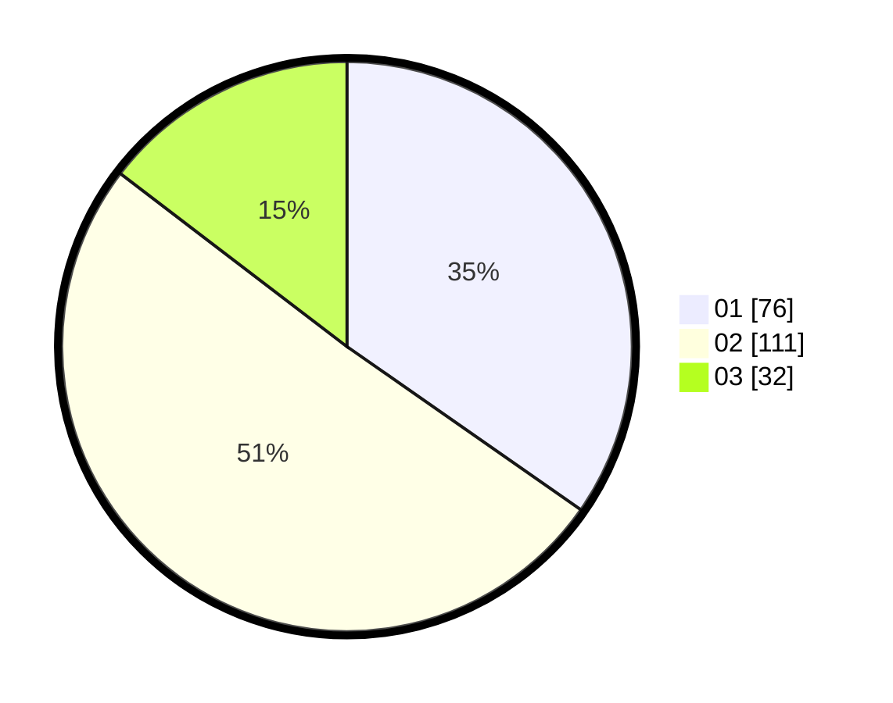

# Hasil

Hasil perolehan suara paslon dapat dilihat pada file paslon-01.txt, paslon-02.txt, dan paslon-03.txt.

Jika tidak ada, artinya data tersebut belum ada pada SIREKAP.

## Perolehan Suara

 * Paslon 01: **76**.
 * Paslon 02: **111**.
 * Paslon 03: **32**.

## Foto C Plano

https://sirekap-obj-formc.kpu.go.id/6ba5/pemilu/ppwp/31/72/06/10/03/3172061003108-20240216-185758--b084721b-d2c1-4585-a73d-72325b987761.jpg

https://sirekap-obj-formc.kpu.go.id/6ba5/pemilu/ppwp/31/72/06/10/03/3172061003108-20240216-190034--0a71af19-b84b-484f-981c-648cb707cc27.jpg

https://sirekap-obj-formc.kpu.go.id/6ba5/pemilu/ppwp/31/72/06/10/03/3172061003108-20240216-190155--bd4b27d2-5994-41e8-b832-5f4a3d37ea81.jpg

## DATA PEMILIH TETAP

Jumlah pemilih dalam DPT: **260**.
 * L: **128**.
 * P: **132**.

## DATA PENGGUNA HAK PILIH

Jumlah pengguna hak pilih dalam DPT: **214**.
 * L: **103**.
 * P: **111**.

Jumlah pengguna hak pilih dalam DPTb: **6**.
 * L: **3**.
 * P: **3**.

Jumlah pengguna hak pilih dalam DPK: **0**.
 * L: **0**.
 * P: **0**.

Jumlah pengguna hak pilih: **220**.
 * L: **106**.
 * P: **114**.

## JUMLAH SUARA SAH DAN TIDAK SAH

JUMLAH SELURUH SUARA SAH: **219**.

JUMLAH SUARA TIDAK SAH: **1**.

JUMLAH SELURUH SUARA SAH DAN SUARA TIDAK SAH: **220**.
