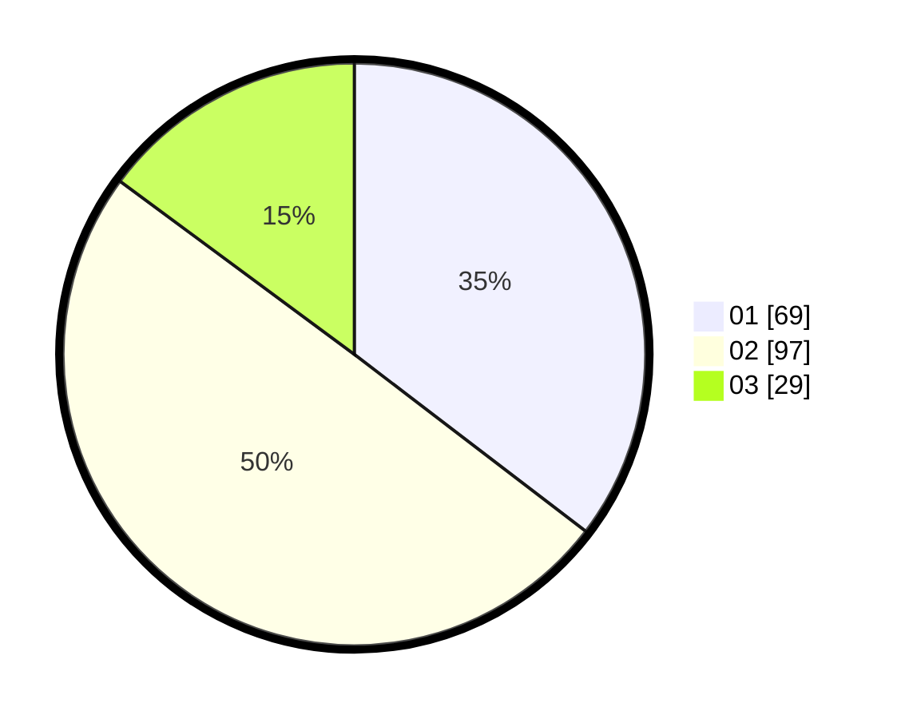

# Hasil

Hasil perolehan suara paslon dapat dilihat pada file paslon-01.txt, paslon-02.txt, dan paslon-03.txt.

Jika tidak ada, artinya data tersebut belum ada pada SIREKAP.

## Perolehan Suara

 * Paslon 01: **69**.
 * Paslon 02: **97**.
 * Paslon 03: **29**.

## Foto C Plano

https://sirekap-obj-formc.kpu.go.id/b6e9/pemilu/ppwp/31/72/06/10/03/3172061003112-20240214-233939--748b2b93-b4e9-46f8-9a9f-7581969085cd.jpg

https://sirekap-obj-formc.kpu.go.id/b6e9/pemilu/ppwp/31/72/06/10/03/3172061003112-20240214-234104--6ee58369-0b36-49ce-a3e0-b0651a9d496f.jpg

https://sirekap-obj-formc.kpu.go.id/b6e9/pemilu/ppwp/31/72/06/10/03/3172061003112-20240218-233055--a825fc4b-c9f2-41e1-be6c-502d86cea25e.jpg

## DATA PEMILIH TETAP

Jumlah pemilih dalam DPT: **288**.
 * L: **148**.
 * P: **140**.

## DATA PENGGUNA HAK PILIH

Jumlah pengguna hak pilih dalam DPT: **188**.
 * L: **97**.
 * P: **91**.

Jumlah pengguna hak pilih dalam DPTb: **3**.
 * L: **2**.
 * P: **1**.

Jumlah pengguna hak pilih dalam DPK: **4**.
 * L: **2**.
 * P: **2**.

Jumlah pengguna hak pilih: **195**.
 * L: **101**.
 * P: **94**.

## JUMLAH SUARA SAH DAN TIDAK SAH

JUMLAH SELURUH SUARA SAH: **195**.

JUMLAH SUARA TIDAK SAH: **0**.

JUMLAH SELURUH SUARA SAH DAN SUARA TIDAK SAH: **195**.
