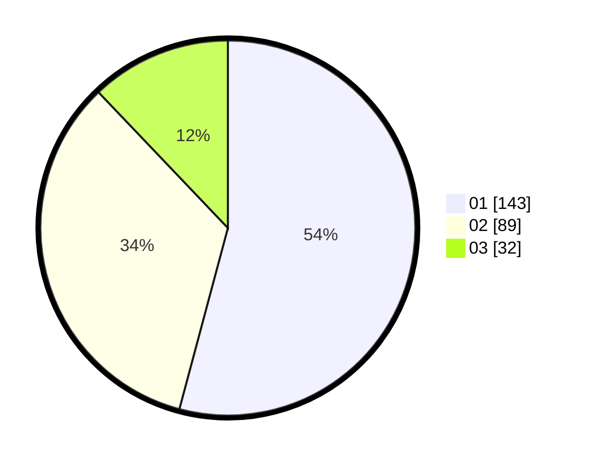

# Hasil

Hasil perolehan suara paslon dapat dilihat pada file paslon-01.txt, paslon-02.txt, dan paslon-03.txt.

Jika tidak ada, artinya data tersebut belum ada pada SIREKAP.

## Perolehan Suara

 * Paslon 01: **143**.
 * Paslon 02: **89**.
 * Paslon 03: **32**.

## Foto C Plano

https://sirekap-obj-formc.kpu.go.id/37f0/pemilu/ppwp/31/73/01/10/01/3173011001003-20240214-222002--e4a5b5b3-4388-4f86-a9f3-6c3bbd955830.jpg

https://sirekap-obj-formc.kpu.go.id/37f0/pemilu/ppwp/31/73/01/10/01/3173011001003-20240214-222126--2460a470-f35d-446e-be93-7c983bc98521.jpg

https://sirekap-obj-formc.kpu.go.id/37f0/pemilu/ppwp/31/73/01/10/01/3173011001003-20240214-222225--6926c3c2-da9f-484d-a533-c7f1d6bd4e94.jpg
