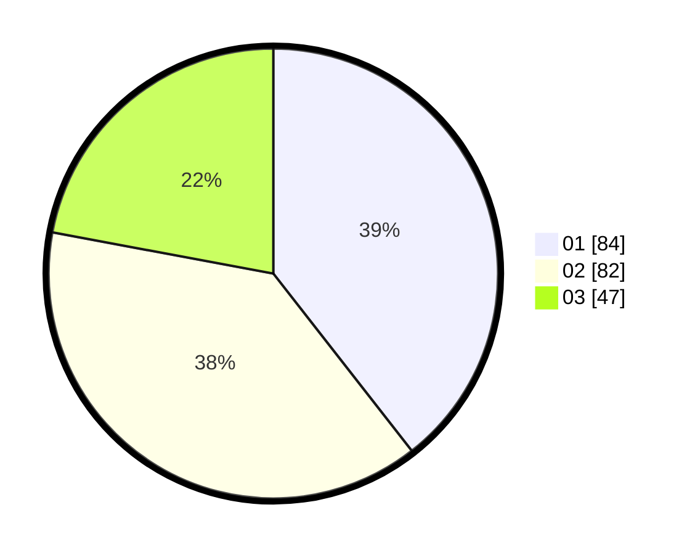

# Hasil

Hasil perolehan suara paslon dapat dilihat pada file paslon-01.txt, paslon-02.txt, dan paslon-03.txt.

Jika tidak ada, artinya data tersebut belum ada pada SIREKAP.

## Perolehan Suara

 * Paslon 01: **84**.
 * Paslon 02: **82**.
 * Paslon 03: **47**.

## Foto C Plano

https://sirekap-obj-formc.kpu.go.id/a943/pemilu/ppwp/31/73/01/10/01/3173011001007-20240215-012913--856cef23-396f-48e6-8945-41e98b0bfd60.jpg

https://sirekap-obj-formc.kpu.go.id/a943/pemilu/ppwp/31/73/01/10/01/3173011001007-20240215-013023--e4337f35-ebac-40bb-a273-14a89ba7dcdc.jpg

https://sirekap-obj-formc.kpu.go.id/a943/pemilu/ppwp/31/73/01/10/01/3173011001007-20240215-013128--2133a62c-a350-4afc-ba18-ba26bed74aa6.jpg
