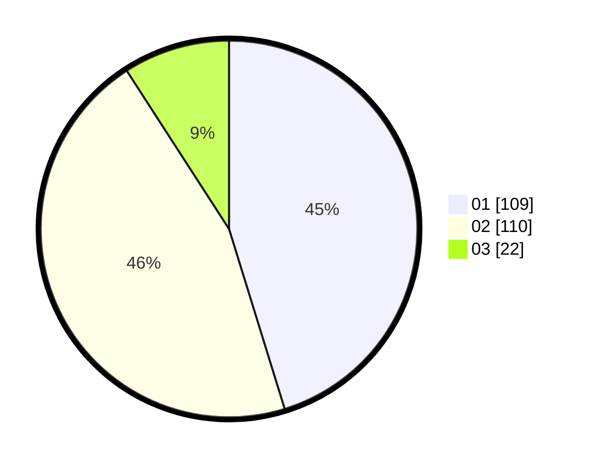

# Hasil

Hasil perolehan suara paslon dapat dilihat pada file paslon-01.txt, paslon-02.txt, dan paslon-03.txt.

Jika tidak ada, artinya data tersebut belum ada pada SIREKAP.

## Perolehan Suara

 * Paslon 01: **109**.
 * Paslon 02: **110**.
 * Paslon 03: **22**.

## Foto C Plano

https://sirekap-obj-formc.kpu.go.id/73be/pemilu/ppwp/31/73/01/10/01/3173011001008-20240214-224504--83b9bf8d-5f70-4636-959c-a543a1b3a1b5.jpg

https://sirekap-obj-formc.kpu.go.id/73be/pemilu/ppwp/31/73/01/10/01/3173011001008-20240214-224627--0779491b-8078-4b50-b20b-92a3286b7470.jpg

https://sirekap-obj-formc.kpu.go.id/73be/pemilu/ppwp/31/73/01/10/01/3173011001008-20240214-224809--5ef1a2d8-5ba0-4ba0-b15f-c14d412e6fa6.jpg
