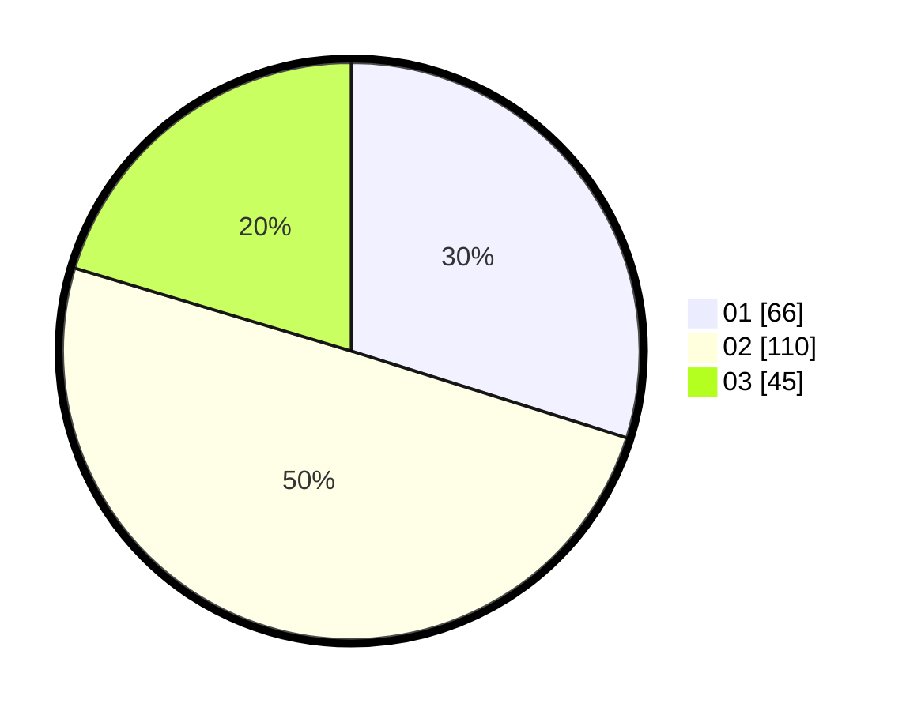

# Hasil

Hasil perolehan suara paslon dapat dilihat pada file paslon-01.txt, paslon-02.txt, dan paslon-03.txt.

Jika tidak ada, artinya data tersebut belum ada pada SIREKAP.

## Perolehan Suara

 * Paslon 01: **66**.
 * Paslon 02: **110**.
 * Paslon 03: **45**.

## Foto C Plano

https://sirekap-obj-formc.kpu.go.id/3727/pemilu/ppwp/31/73/01/10/01/3173011001011-20240214-230252--6a6d7a2e-671e-45ac-8ec2-fed9d1ed9380.jpg

https://sirekap-obj-formc.kpu.go.id/3727/pemilu/ppwp/31/73/01/10/01/3173011001011-20240214-210400--dbcd155f-1431-41cc-8bc9-637ae89c5642.jpg

https://sirekap-obj-formc.kpu.go.id/3727/pemilu/ppwp/31/73/01/10/01/3173011001011-20240214-195543--fdb5e9d0-f4d1-447f-83e4-6706df7c673c.jpg
