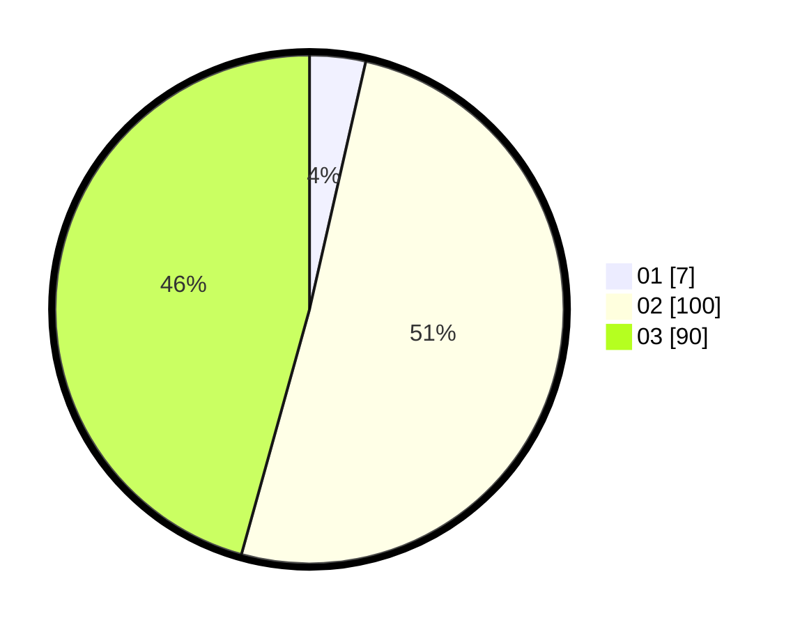

# Hasil

Hasil perolehan suara paslon dapat dilihat pada file paslon-01.txt, paslon-02.txt, dan paslon-03.txt.

Jika tidak ada, artinya data tersebut belum ada pada SIREKAP.

## Perolehan Suara

 * Paslon 01: **7**.
 * Paslon 02: **100**.
 * Paslon 03: **90**.

## Foto C Plano

https://sirekap-obj-formc.kpu.go.id/57d2/pemilu/ppwp/31/73/01/10/01/3173011001012-20240214-193126--2fe47605-a075-43ad-b913-f3442ffe5e62.jpg

https://sirekap-obj-formc.kpu.go.id/57d2/pemilu/ppwp/31/73/01/10/01/3173011001012-20240214-193139--18002d6f-c6e7-4fb4-9b47-7f0d2cea7330.jpg

https://sirekap-obj-formc.kpu.go.id/57d2/pemilu/ppwp/31/73/01/10/01/3173011001012-20240214-193153--e7b808d2-ca09-40ee-ac28-1645eb898c90.jpg

## DATA PEMILIH TETAP

Jumlah pemilih dalam DPT: **197**.
 * L: **103**.
 * P: **94**.

## DATA PENGGUNA HAK PILIH

Jumlah pengguna hak pilih dalam DPT: **195**.
 * L: **102**.
 * P: **93**.

Jumlah pengguna hak pilih dalam DPTb: **0**.
 * L: **0**.
 * P: **0**.

Jumlah pengguna hak pilih dalam DPK: **2**.
 * L: **1**.
 * P: **1**.

Jumlah pengguna hak pilih: **197**.
 * L: **103**.
 * P: **94**.

## JUMLAH SUARA SAH DAN TIDAK SAH

JUMLAH SELURUH SUARA SAH: **197**.

JUMLAH SUARA TIDAK SAH: **0**.

JUMLAH SELURUH SUARA SAH DAN SUARA TIDAK SAH: **197**.
