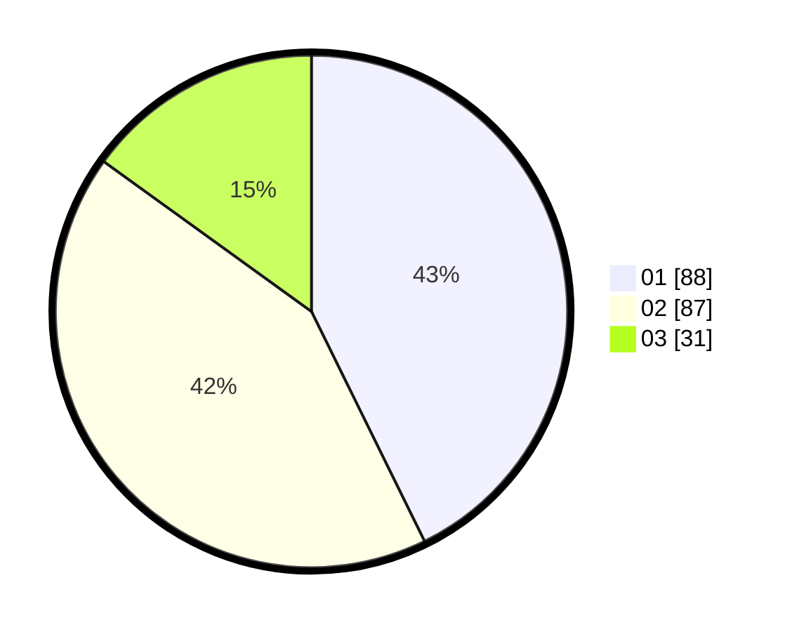

# Hasil

Hasil perolehan suara paslon dapat dilihat pada file paslon-01.txt, paslon-02.txt, dan paslon-03.txt.

Jika tidak ada, artinya data tersebut belum ada pada SIREKAP.

## Perolehan Suara

 * Paslon 01: **88**.
 * Paslon 02: **87**.
 * Paslon 03: **31**.

## Foto C Plano

https://sirekap-obj-formc.kpu.go.id/e3ee/pemilu/ppwp/31/73/01/10/01/3173011001014-20240214-210238--c4c3f8ab-2985-487d-8fe8-3d3050091586.jpg

https://sirekap-obj-formc.kpu.go.id/e3ee/pemilu/ppwp/31/73/01/10/01/3173011001014-20240214-232311--058a86ac-6b3d-4854-80cf-1bc22d7cdabc.jpg

https://sirekap-obj-formc.kpu.go.id/e3ee/pemilu/ppwp/31/73/01/10/01/3173011001014-20240214-231921--9c8c7e76-899b-4565-ae0d-f9459217a339.jpg
