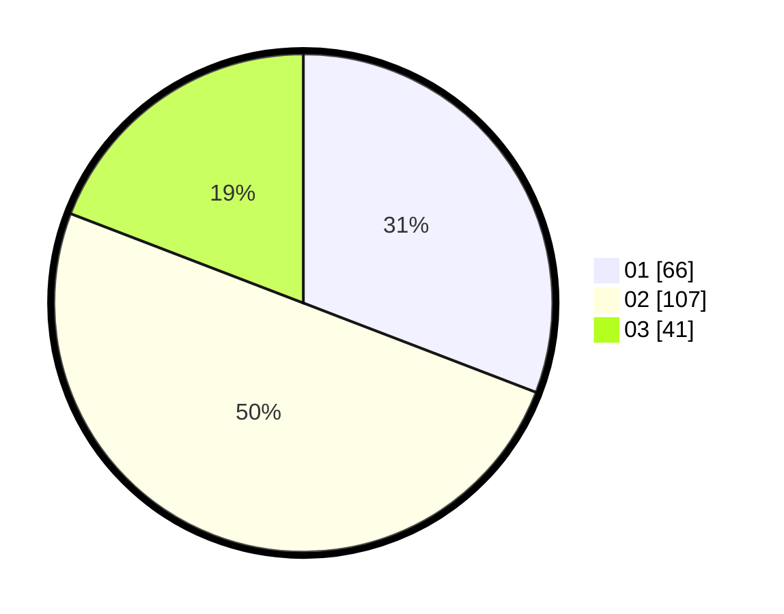

# Hasil

Hasil perolehan suara paslon dapat dilihat pada file paslon-01.txt, paslon-02.txt, dan paslon-03.txt.

Jika tidak ada, artinya data tersebut belum ada pada SIREKAP.

## Perolehan Suara

 * Paslon 01: **66**.
 * Paslon 02: **107**.
 * Paslon 03: **41**.

## Foto C Plano

https://sirekap-obj-formc.kpu.go.id/5d43/pemilu/ppwp/31/73/01/10/01/3173011001015-20240215-205911--a3b6519e-7c1e-4f1a-a26a-ce8fe6174d84.jpg

https://sirekap-obj-formc.kpu.go.id/5d43/pemilu/ppwp/31/73/01/10/01/3173011001015-20240215-155015--172be7b7-87e5-4d4a-903d-64999b8ba7de.jpg

https://sirekap-obj-formc.kpu.go.id/5d43/pemilu/ppwp/31/73/01/10/01/3173011001015-20240215-155329--31b2e321-7cc2-49d8-9d49-ae2d865204d7.jpg
