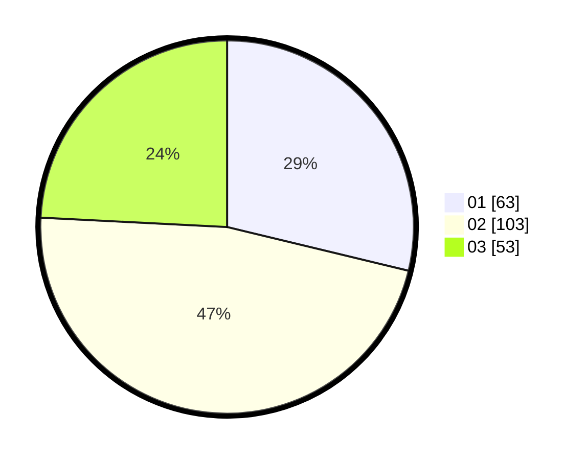

# Hasil

Hasil perolehan suara paslon dapat dilihat pada file paslon-01.txt, paslon-02.txt, dan paslon-03.txt.

Jika tidak ada, artinya data tersebut belum ada pada SIREKAP.

## Perolehan Suara

 * Paslon 01: **63**.
 * Paslon 02: **103**.
 * Paslon 03: **53**.

## Foto C Plano

https://sirekap-obj-formc.kpu.go.id/0511/pemilu/ppwp/31/73/01/10/01/3173011001016-20240214-194939--a901abf5-0ed3-4da3-aa31-1468ca204185.jpg

https://sirekap-obj-formc.kpu.go.id/0511/pemilu/ppwp/31/73/01/10/01/3173011001016-20240214-212036--9609395c-eeb5-4d1c-975b-6021a26df6dd.jpg

https://sirekap-obj-formc.kpu.go.id/0511/pemilu/ppwp/31/73/01/10/01/3173011001016-20240214-195005--3198e433-38f5-4988-813d-06091948f97d.jpg

## DATA PEMILIH TETAP

Jumlah pemilih dalam DPT: **280**.
 * L: **129**.
 * P: **151**.

## DATA PENGGUNA HAK PILIH

Jumlah pengguna hak pilih dalam DPT: **217**.
 * L: **96**.
 * P: **121**.

Jumlah pengguna hak pilih dalam DPTb: **0**.
 * L: **0**.
 * P: **0**.

Jumlah pengguna hak pilih dalam DPK: **2**.
 * L: **0**.
 * P: **2**.

Jumlah pengguna hak pilih: **219**.
 * L: **96**.
 * P: **123**.

## JUMLAH SUARA SAH DAN TIDAK SAH

JUMLAH SELURUH SUARA SAH: **219**.

JUMLAH SUARA TIDAK SAH: **0**.

JUMLAH SELURUH SUARA SAH DAN SUARA TIDAK SAH: **219**.
