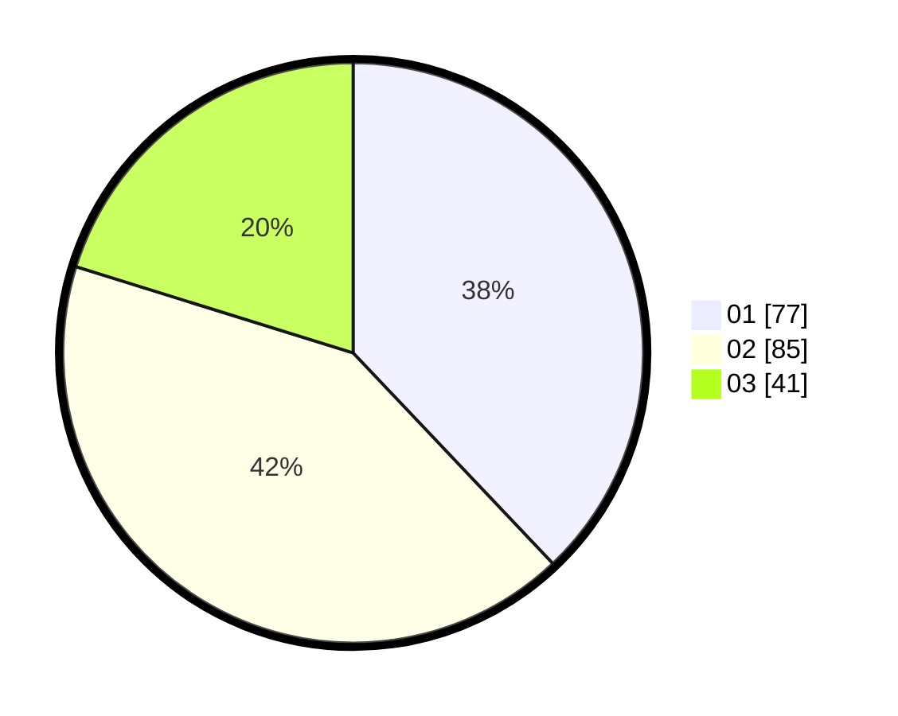

# Hasil

Hasil perolehan suara paslon dapat dilihat pada file paslon-01.txt, paslon-02.txt, dan paslon-03.txt.

Jika tidak ada, artinya data tersebut belum ada pada SIREKAP.

## Perolehan Suara

 * Paslon 01: **77**.
 * Paslon 02: **85**.
 * Paslon 03: **41**.

## Foto C Plano

https://sirekap-obj-formc.kpu.go.id/e3cb/pemilu/ppwp/31/73/01/10/01/3173011001017-20240214-224509--d1d884df-eab6-45df-8faa-43d0d8a9eb25.jpg

https://sirekap-obj-formc.kpu.go.id/e3cb/pemilu/ppwp/31/73/01/10/01/3173011001017-20240214-224339--69a76c5d-ccf6-4e77-b0f7-47b044e4fc99.jpg

https://sirekap-obj-formc.kpu.go.id/e3cb/pemilu/ppwp/31/73/01/10/01/3173011001017-20240214-224551--b81d5ad3-fd91-4cac-8849-2b9e975870bb.jpg
