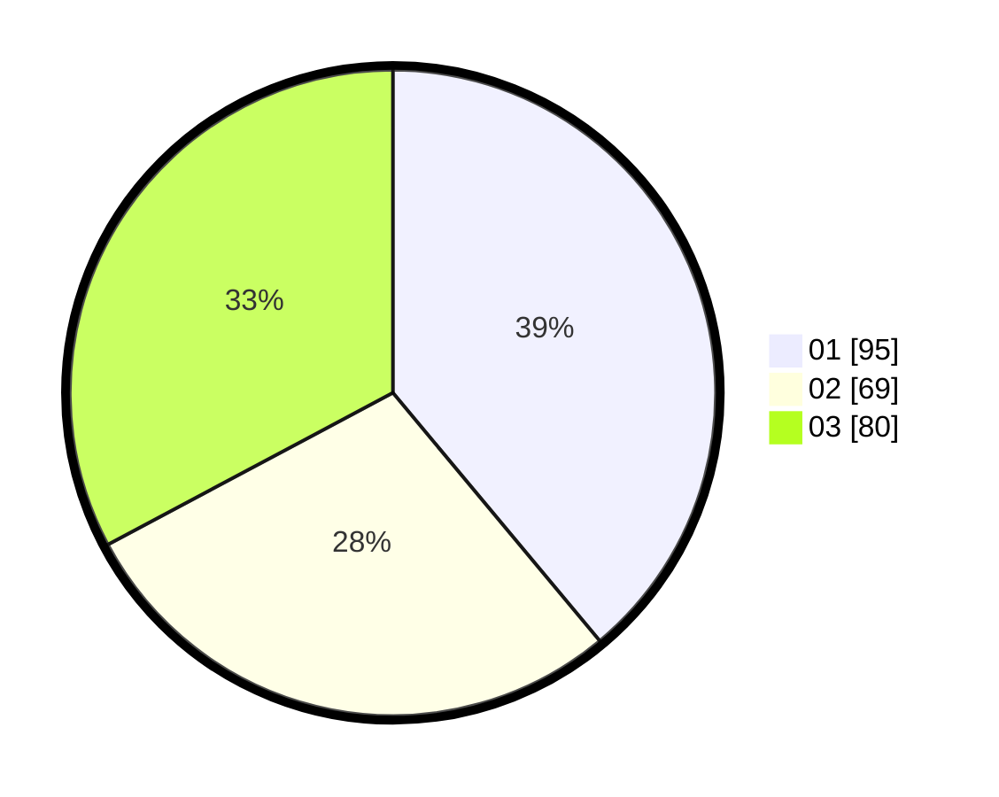

# Hasil

Hasil perolehan suara paslon dapat dilihat pada file paslon-01.txt, paslon-02.txt, dan paslon-03.txt.

Jika tidak ada, artinya data tersebut belum ada pada SIREKAP.

## Perolehan Suara

 * Paslon 01: **95**.
 * Paslon 02: **69**.
 * Paslon 03: **80**.

## Foto C Plano

https://sirekap-obj-formc.kpu.go.id/1d41/pemilu/ppwp/31/73/01/10/01/3173011001018-20240214-193843--d4dd6747-d078-473b-8d45-ac831581ab67.jpg

https://sirekap-obj-formc.kpu.go.id/1d41/pemilu/ppwp/31/73/01/10/01/3173011001018-20240214-193922--067b6f62-424a-4e00-b4d9-2425675483b0.jpg

https://sirekap-obj-formc.kpu.go.id/1d41/pemilu/ppwp/31/73/01/10/01/3173011001018-20240214-194018--3e9b0235-8450-43b7-ba4a-a6c2cee621ac.jpg

## DATA PEMILIH TETAP

Jumlah pemilih dalam DPT: **281**.
 * L: **129**.
 * P: **152**.

## DATA PENGGUNA HAK PILIH

Jumlah pengguna hak pilih dalam DPT: **226**.
 * L: **104**.
 * P: **122**.

Jumlah pengguna hak pilih dalam DPTb: **16**.
 * L: **5**.
 * P: **11**.

Jumlah pengguna hak pilih dalam DPK: **3**.
 * L: **1**.
 * P: **2**.

Jumlah pengguna hak pilih: **245**.
 * L: **110**.
 * P: **135**.

## JUMLAH SUARA SAH DAN TIDAK SAH

JUMLAH SELURUH SUARA SAH: **244**.

JUMLAH SUARA TIDAK SAH: **1**.

JUMLAH SELURUH SUARA SAH DAN SUARA TIDAK SAH: **245**.
