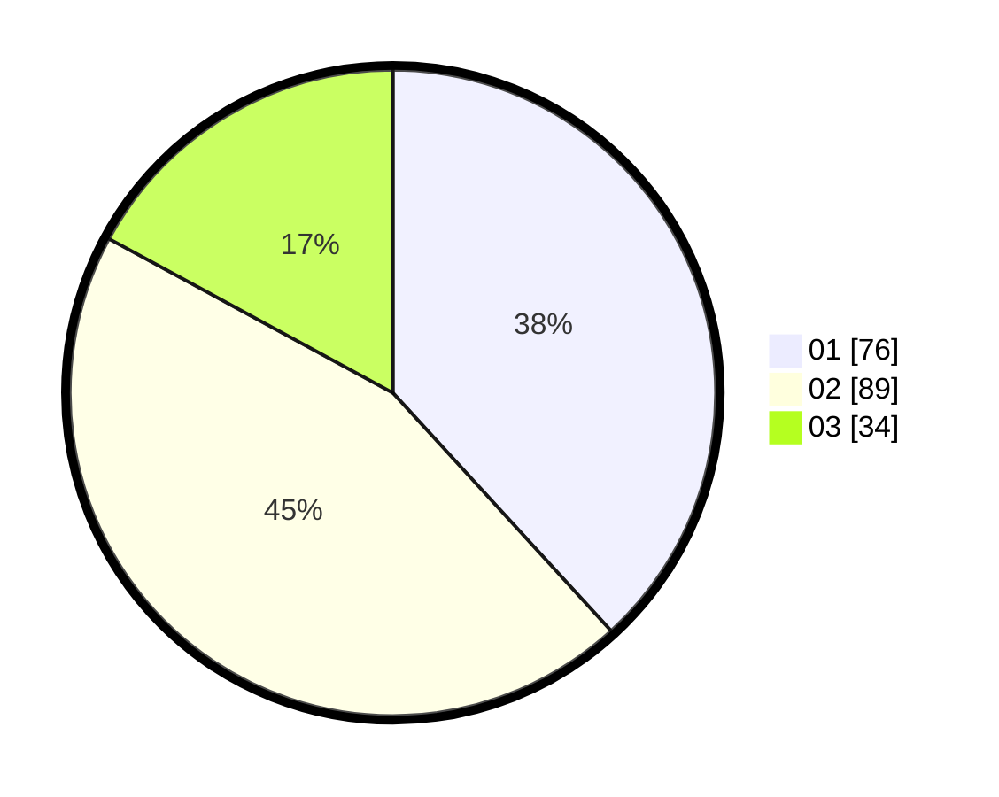

# Hasil

Hasil perolehan suara paslon dapat dilihat pada file paslon-01.txt, paslon-02.txt, dan paslon-03.txt.

Jika tidak ada, artinya data tersebut belum ada pada SIREKAP.

## Perolehan Suara

 * Paslon 01: **76**.
 * Paslon 02: **89**.
 * Paslon 03: **34**.

## Foto C Plano

https://sirekap-obj-formc.kpu.go.id/c6ce/pemilu/ppwp/31/73/01/10/01/3173011001022-20240216-144617--4e425f47-769f-4dc2-b439-2383daec576e.jpg

https://sirekap-obj-formc.kpu.go.id/c6ce/pemilu/ppwp/31/73/01/10/01/3173011001022-20240216-144618--23ed54a5-7369-4b3b-91ac-dd891404c065.jpg

https://sirekap-obj-formc.kpu.go.id/c6ce/pemilu/ppwp/31/73/01/10/01/3173011001022-20240216-144617--338f3890-76d6-4c2b-ac90-6ff476acbd78.jpg

## DATA PEMILIH TETAP

Jumlah pemilih dalam DPT: **0**.
 * L: **0**.
 * P: **0**.

## DATA PENGGUNA HAK PILIH

Jumlah pengguna hak pilih dalam DPT: **0**.
 * L: **0**.
 * P: **0**.

Jumlah pengguna hak pilih dalam DPTb: **0**.
 * L: **0**.
 * P: **0**.

Jumlah pengguna hak pilih dalam DPK: **0**.
 * L: **0**.
 * P: **0**.

Jumlah pengguna hak pilih: **0**.
 * L: **0**.
 * P: **0**.

## JUMLAH SUARA SAH DAN TIDAK SAH

JUMLAH SELURUH SUARA SAH: **199**.

JUMLAH SUARA TIDAK SAH: **2**.

JUMLAH SELURUH SUARA SAH DAN SUARA TIDAK SAH: **201**.
