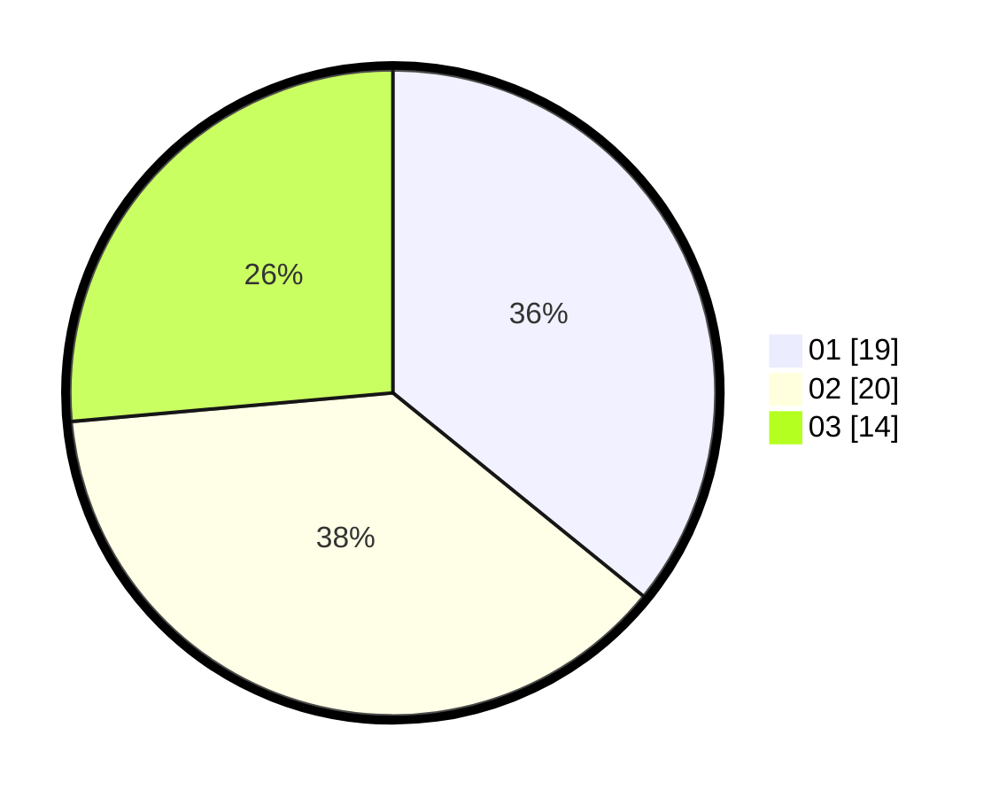

# Hasil

Hasil perolehan suara paslon dapat dilihat pada file paslon-01.txt, paslon-02.txt, dan paslon-03.txt.

Jika tidak ada, artinya data tersebut belum ada pada SIREKAP.

## Perolehan Suara

 * Paslon 01: **19**.
 * Paslon 02: **20**.
 * Paslon 03: **14**.

## Foto C Plano

https://sirekap-obj-formc.kpu.go.id/cedb/pemilu/ppwp/31/73/01/10/01/3173011001028-20240214-212817--b7179282-e309-4f9f-8263-eca1ba8fd3ab.jpg

https://sirekap-obj-formc.kpu.go.id/cedb/pemilu/ppwp/31/73/01/10/01/3173011001028-20240214-213251--c3746cf0-7c81-4f79-ae22-fd63d4e016d4.jpg

https://sirekap-obj-formc.kpu.go.id/cedb/pemilu/ppwp/31/73/01/10/01/3173011001028-20240214-214621--f7fbfee6-9bf4-4c47-995d-db430b68d585.jpg
