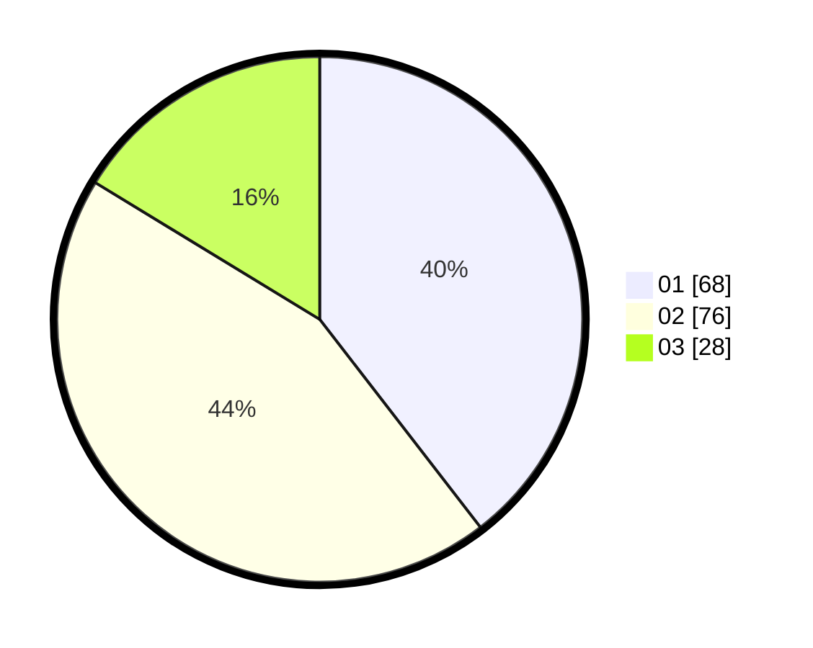

# Hasil

Hasil perolehan suara paslon dapat dilihat pada file paslon-01.txt, paslon-02.txt, dan paslon-03.txt.

Jika tidak ada, artinya data tersebut belum ada pada SIREKAP.

## Perolehan Suara

 * Paslon 01: **68**.
 * Paslon 02: **76**.
 * Paslon 03: **28**.

## Foto C Plano

https://sirekap-obj-formc.kpu.go.id/6b33/pemilu/ppwp/31/73/01/10/01/3173011001029-20240214-200058--08e51706-b650-4384-8b96-7ec089790386.jpg

https://sirekap-obj-formc.kpu.go.id/6b33/pemilu/ppwp/31/73/01/10/01/3173011001029-20240214-200103--3a0cd1f5-08e1-468b-b240-6dc81a5cccdd.jpg

https://sirekap-obj-formc.kpu.go.id/6b33/pemilu/ppwp/31/73/01/10/01/3173011001029-20240214-200106--2d8f4352-1018-4da8-b0fb-18849e73b910.jpg
