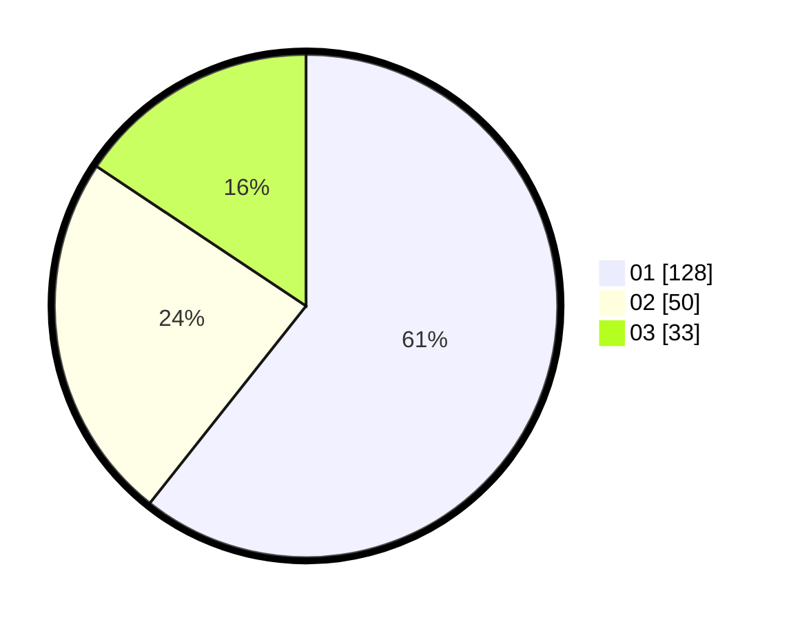

# Hasil

Hasil perolehan suara paslon dapat dilihat pada file paslon-01.txt, paslon-02.txt, dan paslon-03.txt.

Jika tidak ada, artinya data tersebut belum ada pada SIREKAP.

## Perolehan Suara

 * Paslon 01: **128**.
 * Paslon 02: **50**.
 * Paslon 03: **33**.

## Foto C Plano

https://sirekap-obj-formc.kpu.go.id/82b2/pemilu/ppwp/31/73/01/10/01/3173011001032-20240214-231528--93fbce11-5480-4fe9-b08b-deb904880355.jpg

https://sirekap-obj-formc.kpu.go.id/82b2/pemilu/ppwp/31/73/01/10/01/3173011001032-20240214-231714--74ef9b4c-fb74-4301-9d70-8c300c869fac.jpg

https://sirekap-obj-formc.kpu.go.id/82b2/pemilu/ppwp/31/73/01/10/01/3173011001032-20240214-231838--813e0f27-a7cc-4566-abbb-beb3f735466f.jpg
