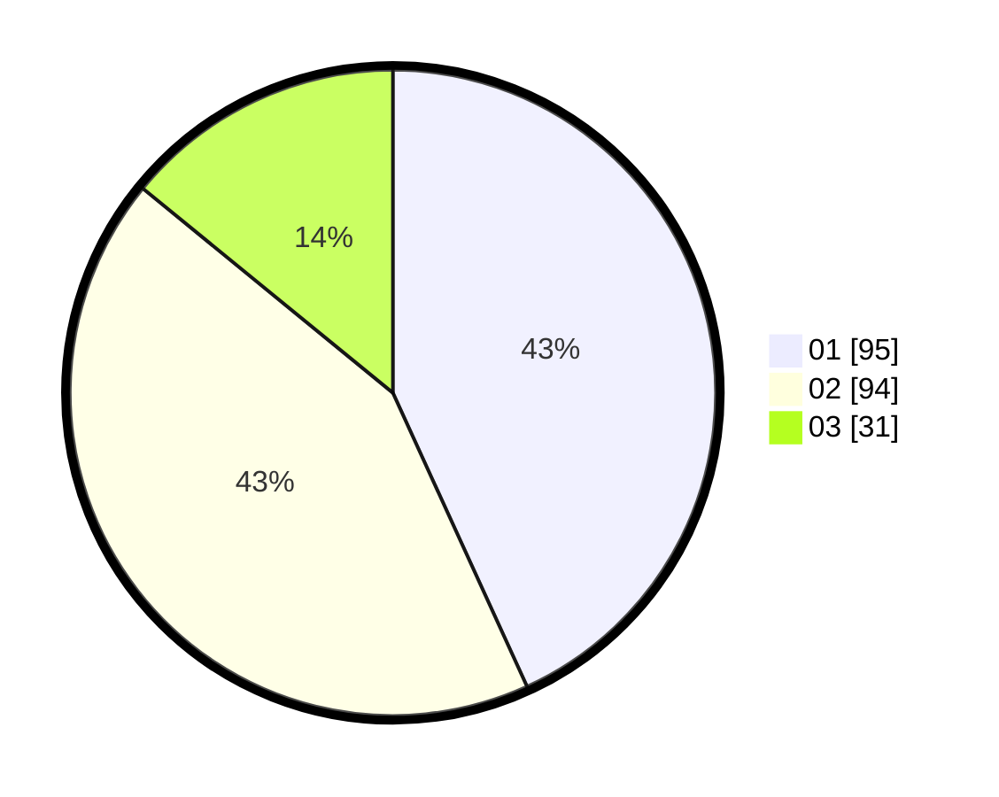

# Hasil

Hasil perolehan suara paslon dapat dilihat pada file paslon-01.txt, paslon-02.txt, dan paslon-03.txt.

Jika tidak ada, artinya data tersebut belum ada pada SIREKAP.

## Perolehan Suara

 * Paslon 01: **95**.
 * Paslon 02: **94**.
 * Paslon 03: **31**.

## Foto C Plano

https://sirekap-obj-formc.kpu.go.id/93a1/pemilu/ppwp/31/73/01/10/01/3173011001034-20240215-010041--04cc5a17-ef3b-4b1f-acbd-af0cfc92a126.jpg

https://sirekap-obj-formc.kpu.go.id/93a1/pemilu/ppwp/31/73/01/10/01/3173011001034-20240215-010232--4b862cae-dc9d-4f37-871a-5c5e801a3652.jpg

https://sirekap-obj-formc.kpu.go.id/93a1/pemilu/ppwp/31/73/01/10/01/3173011001034-20240215-010428--3a9c0949-b347-46b3-8b55-38dd1dbdc9f1.jpg
