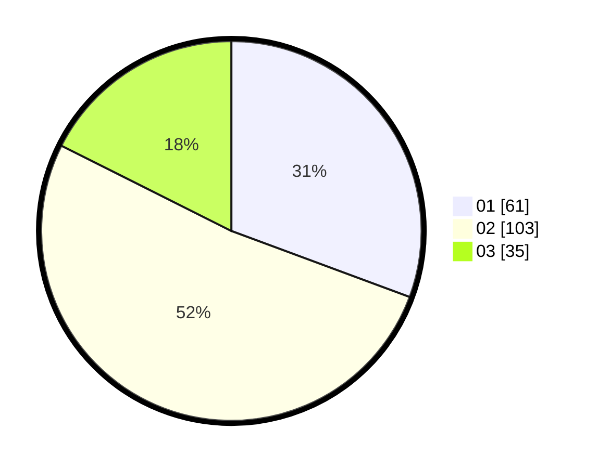

# Hasil

Hasil perolehan suara paslon dapat dilihat pada file paslon-01.txt, paslon-02.txt, dan paslon-03.txt.

Jika tidak ada, artinya data tersebut belum ada pada SIREKAP.

## Perolehan Suara

 * Paslon 01: **61**.
 * Paslon 02: **103**.
 * Paslon 03: **35**.

## Foto C Plano

https://sirekap-obj-formc.kpu.go.id/8688/pemilu/ppwp/31/73/01/10/01/3173011001035-20240216-093154--0c6f63eb-c15f-44cd-a8e6-e0322ab5dfe1.jpg

https://sirekap-obj-formc.kpu.go.id/8688/pemilu/ppwp/31/73/01/10/01/3173011001035-20240216-093156--f5eceeb4-a8ce-4df8-b624-9b4c7f42a47d.jpg

https://sirekap-obj-formc.kpu.go.id/8688/pemilu/ppwp/31/73/01/10/01/3173011001035-20240216-093155--4ad12f2f-3363-4834-b9aa-5c23cd8c0f16.jpg

## DATA PEMILIH TETAP

Jumlah pemilih dalam DPT: **235**.
 * L: **119**.
 * P: **116**.

## DATA PENGGUNA HAK PILIH

Jumlah pengguna hak pilih dalam DPT: **188**.
 * L: **101**.
 * P: **87**.

Jumlah pengguna hak pilih dalam DPTb: **12**.
 * L: **6**.
 * P: **6**.

Jumlah pengguna hak pilih dalam DPK: **0**.
 * L: **0**.
 * P: **0**.

Jumlah pengguna hak pilih: **200**.
 * L: **107**.
 * P: **93**.

## JUMLAH SUARA SAH DAN TIDAK SAH

JUMLAH SELURUH SUARA SAH: **199**.

JUMLAH SUARA TIDAK SAH: **1**.

JUMLAH SELURUH SUARA SAH DAN SUARA TIDAK SAH: **200**.
