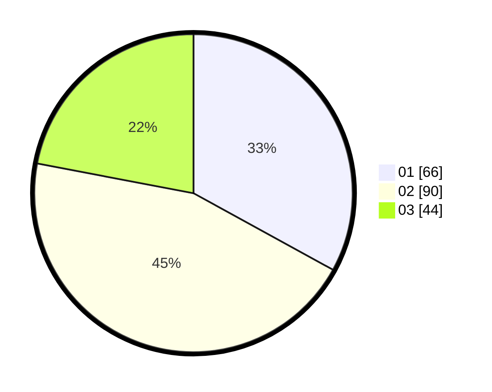

# Hasil

Hasil perolehan suara paslon dapat dilihat pada file paslon-01.txt, paslon-02.txt, dan paslon-03.txt.

Jika tidak ada, artinya data tersebut belum ada pada SIREKAP.

## Perolehan Suara

 * Paslon 01: **66**.
 * Paslon 02: **90**.
 * Paslon 03: **44**.

## Foto C Plano

https://sirekap-obj-formc.kpu.go.id/2996/pemilu/ppwp/31/73/01/10/01/3173011001036-20240214-213917--e19a1ecf-6479-44be-a459-2a9f799e8d6f.jpg

https://sirekap-obj-formc.kpu.go.id/2996/pemilu/ppwp/31/73/01/10/01/3173011001036-20240214-214058--7b25af95-eee0-4fa9-b06b-d57b7b191661.jpg

https://sirekap-obj-formc.kpu.go.id/2996/pemilu/ppwp/31/73/01/10/01/3173011001036-20240214-214247--d192bb8c-0372-41a8-b047-5065a0d13506.jpg
