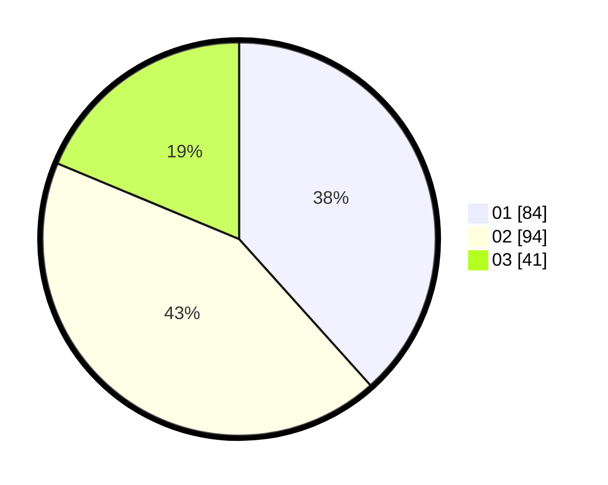

# Hasil

Hasil perolehan suara paslon dapat dilihat pada file paslon-01.txt, paslon-02.txt, dan paslon-03.txt.

Jika tidak ada, artinya data tersebut belum ada pada SIREKAP.

## Perolehan Suara

 * Paslon 01: **84**.
 * Paslon 02: **94**.
 * Paslon 03: **41**.

## Foto C Plano

https://sirekap-obj-formc.kpu.go.id/0abf/pemilu/ppwp/31/73/01/10/01/3173011001038-20240214-204355--c602e813-a1d0-4b61-bcef-85c264faca92.jpg

https://sirekap-obj-formc.kpu.go.id/0abf/pemilu/ppwp/31/73/01/10/01/3173011001038-20240214-221231--e0859f96-74cb-4a6e-8188-96843db7fa98.jpg

https://sirekap-obj-formc.kpu.go.id/0abf/pemilu/ppwp/31/73/01/10/01/3173011001038-20240214-205205--ef5c2c8e-9473-42d7-aac0-ebc9fd48dd7a.jpg

## DATA PEMILIH TETAP

Jumlah pemilih dalam DPT: **293**.
 * L: **147**.
 * P: **146**.

## DATA PENGGUNA HAK PILIH

Jumlah pengguna hak pilih dalam DPT: **207**.
 * L: **98**.
 * P: **109**.

Jumlah pengguna hak pilih dalam DPTb: **1**.
 * L: **1**.
 * P: **0**.

Jumlah pengguna hak pilih dalam DPK: **13**.
 * L: **5**.
 * P: **8**.

Jumlah pengguna hak pilih: **221**.
 * L: **104**.
 * P: **117**.

## JUMLAH SUARA SAH DAN TIDAK SAH

JUMLAH SELURUH SUARA SAH: **219**.

JUMLAH SUARA TIDAK SAH: **2**.

JUMLAH SELURUH SUARA SAH DAN SUARA TIDAK SAH: **221**.
