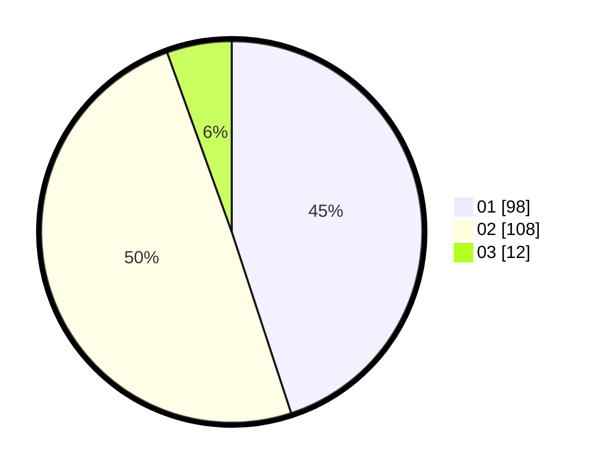

# Hasil

Hasil perolehan suara paslon dapat dilihat pada file paslon-01.txt, paslon-02.txt, dan paslon-03.txt.

Jika tidak ada, artinya data tersebut belum ada pada SIREKAP.

## Perolehan Suara

 * Paslon 01: **98**.
 * Paslon 02: **108**.
 * Paslon 03: **12**.

## Foto C Plano

https://sirekap-obj-formc.kpu.go.id/918e/pemilu/ppwp/31/73/01/10/01/3173011001039-20240214-222109--77a3962a-991c-4580-b9b3-2b4d610125ad.jpg

https://sirekap-obj-formc.kpu.go.id/918e/pemilu/ppwp/31/73/01/10/01/3173011001039-20240215-011401--7edaa99e-16fc-43f4-afe1-eb112b3beda8.jpg

https://sirekap-obj-formc.kpu.go.id/918e/pemilu/ppwp/31/73/01/10/01/3173011001039-20240215-011535--354a8717-b68e-4d47-83cb-cc4db9b07e31.jpg

## DATA PEMILIH TETAP

Jumlah pemilih dalam DPT: **292**.
 * L: **158**.
 * P: **134**.

## DATA PENGGUNA HAK PILIH

Jumlah pengguna hak pilih dalam DPT: **214**.
 * L: **113**.
 * P: **101**.

Jumlah pengguna hak pilih dalam DPTb: **6**.
 * L: **2**.
 * P: **4**.

Jumlah pengguna hak pilih dalam DPK: **2**.
 * L: **1**.
 * P: **1**.

Jumlah pengguna hak pilih: **222**.
 * L: **115**.
 * P: **106**.

## JUMLAH SUARA SAH DAN TIDAK SAH

JUMLAH SELURUH SUARA SAH: **218**.

JUMLAH SUARA TIDAK SAH: **2**.

JUMLAH SELURUH SUARA SAH DAN SUARA TIDAK SAH: **220**.
