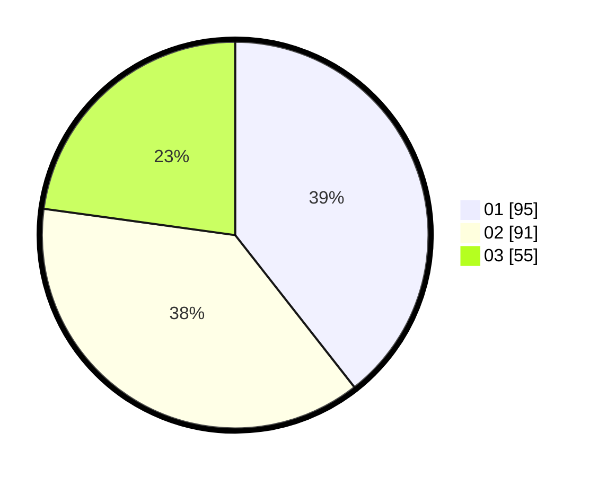

# Hasil

Hasil perolehan suara paslon dapat dilihat pada file paslon-01.txt, paslon-02.txt, dan paslon-03.txt.

Jika tidak ada, artinya data tersebut belum ada pada SIREKAP.

## Perolehan Suara

 * Paslon 01: **95**.
 * Paslon 02: **91**.
 * Paslon 03: **55**.

## Foto C Plano

https://sirekap-obj-formc.kpu.go.id/42b3/pemilu/ppwp/31/73/01/10/01/3173011001044-20240214-193626--3ad7b420-ae6a-4787-b251-4c5753e3b8d5.jpg

https://sirekap-obj-formc.kpu.go.id/42b3/pemilu/ppwp/31/73/01/10/01/3173011001044-20240216-130703--2bd28d54-c557-4447-b5b8-0859eb698827.jpg

https://sirekap-obj-formc.kpu.go.id/42b3/pemilu/ppwp/31/73/01/10/01/3173011001044-20240214-205050--cd29111a-81e8-4446-93c3-ddd1bfdd967d.jpg

## DATA PEMILIH TETAP

Jumlah pemilih dalam DPT: **280**.
 * L: **142**.
 * P: **138**.

## DATA PENGGUNA HAK PILIH

Jumlah pengguna hak pilih dalam DPT: **234**.
 * L: **120**.
 * P: **114**.

Jumlah pengguna hak pilih dalam DPTb: **4**.
 * L: **3**.
 * P: **1**.

Jumlah pengguna hak pilih dalam DPK: **5**.
 * L: **3**.
 * P: **2**.

Jumlah pengguna hak pilih: **243**.
 * L: **126**.
 * P: **117**.

## JUMLAH SUARA SAH DAN TIDAK SAH

JUMLAH SELURUH SUARA SAH: **241**.

JUMLAH SUARA TIDAK SAH: **2**.

JUMLAH SELURUH SUARA SAH DAN SUARA TIDAK SAH: **243**.
