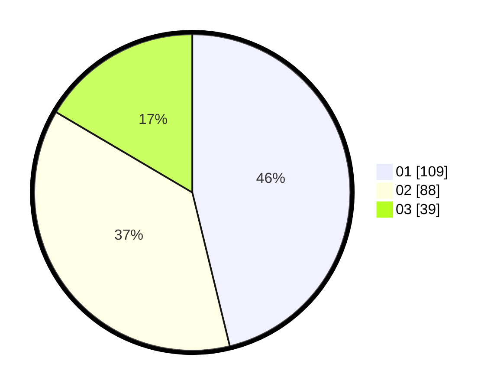

# Hasil

Hasil perolehan suara paslon dapat dilihat pada file paslon-01.txt, paslon-02.txt, dan paslon-03.txt.

Jika tidak ada, artinya data tersebut belum ada pada SIREKAP.

## Perolehan Suara

 * Paslon 01: **109**.
 * Paslon 02: **88**.
 * Paslon 03: **39**.

## Foto C Plano

https://sirekap-obj-formc.kpu.go.id/1617/pemilu/ppwp/31/73/01/10/01/3173011001047-20240215-155746--fbb66dae-25e9-4a74-ba41-1c6b80a22e5f.jpg

https://sirekap-obj-formc.kpu.go.id/1617/pemilu/ppwp/31/73/01/10/01/3173011001047-20240215-111311--fcd21e2a-04e3-4f9c-8bb2-c8cc45ca8c4f.jpg

https://sirekap-obj-formc.kpu.go.id/1617/pemilu/ppwp/31/73/01/10/01/3173011001047-20240215-111349--a853fda0-75e5-4607-a449-16eb1c7c2251.jpg

## DATA PEMILIH TETAP

Jumlah pemilih dalam DPT: **280**.
 * L: **134**.
 * P: **146**.

## DATA PENGGUNA HAK PILIH

Jumlah pengguna hak pilih dalam DPT: **233**.
 * L: **112**.
 * P: **121**.

Jumlah pengguna hak pilih dalam DPTb: **2**.
 * L: **0**.
 * P: **2**.

Jumlah pengguna hak pilih dalam DPK: **2**.
 * L: **0**.
 * P: **2**.

Jumlah pengguna hak pilih: **237**.
 * L: **112**.
 * P: **125**.

## JUMLAH SUARA SAH DAN TIDAK SAH

JUMLAH SELURUH SUARA SAH: **236**.

JUMLAH SUARA TIDAK SAH: **1**.

JUMLAH SELURUH SUARA SAH DAN SUARA TIDAK SAH: **237**.
