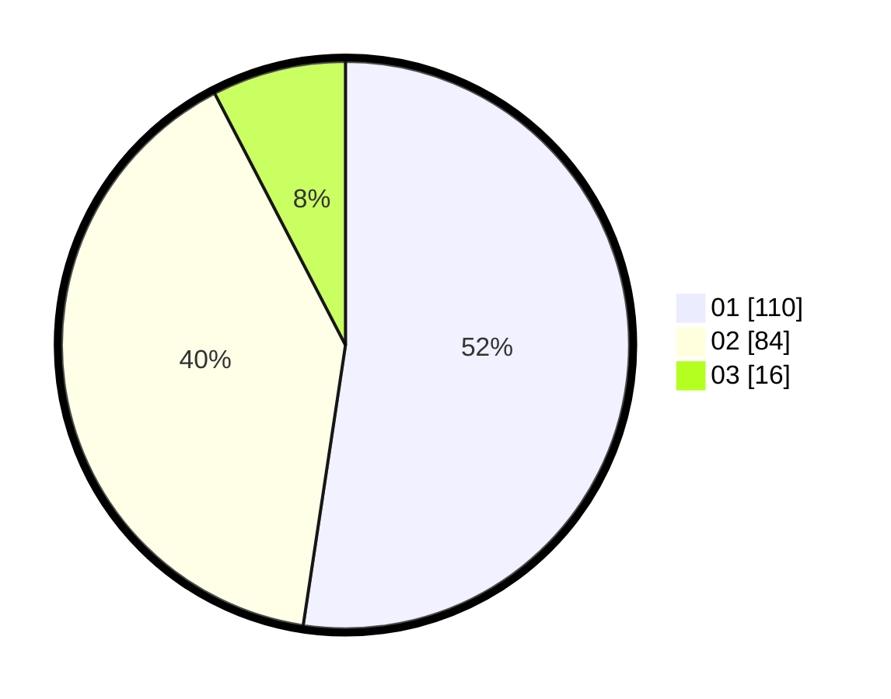

# Hasil

Hasil perolehan suara paslon dapat dilihat pada file paslon-01.txt, paslon-02.txt, dan paslon-03.txt.

Jika tidak ada, artinya data tersebut belum ada pada SIREKAP.

## Perolehan Suara

 * Paslon 01: **110**.
 * Paslon 02: **84**.
 * Paslon 03: **16**.

## Foto C Plano

https://sirekap-obj-formc.kpu.go.id/1b58/pemilu/ppwp/31/73/01/10/01/3173011001048-20240215-013303--091488e1-689e-4be7-8795-aa5aa2d65ff4.jpg

https://sirekap-obj-formc.kpu.go.id/1b58/pemilu/ppwp/31/73/01/10/01/3173011001048-20240214-235359--48180b9b-004f-44e8-8458-fe07dca09b3c.jpg
