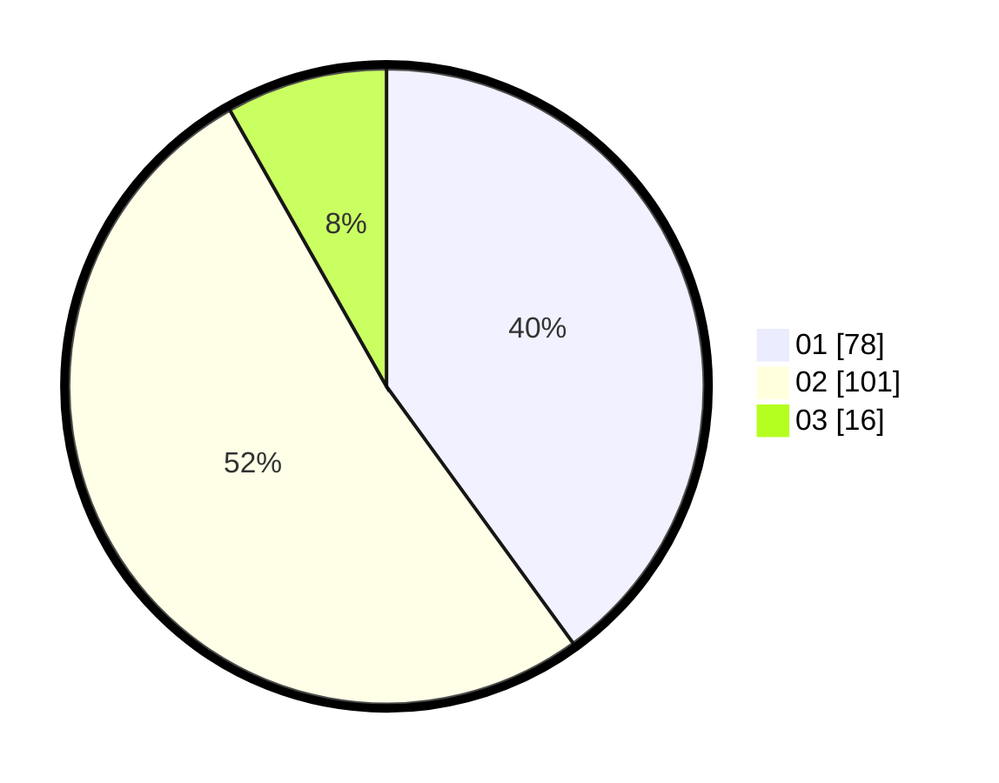

# Hasil

Hasil perolehan suara paslon dapat dilihat pada file paslon-01.txt, paslon-02.txt, dan paslon-03.txt.

Jika tidak ada, artinya data tersebut belum ada pada SIREKAP.

## Perolehan Suara

 * Paslon 01: **78**.
 * Paslon 02: **101**.
 * Paslon 03: **16**.

## Foto C Plano

https://sirekap-obj-formc.kpu.go.id/a420/pemilu/ppwp/31/73/01/10/01/3173011001050-20240215-011635--97084088-54c9-4749-91ff-da31c2d17a6a.jpg

https://sirekap-obj-formc.kpu.go.id/a420/pemilu/ppwp/31/73/01/10/01/3173011001050-20240215-011720--191d6678-5e79-4931-a35d-a13bdd158db4.jpg

https://sirekap-obj-formc.kpu.go.id/a420/pemilu/ppwp/31/73/01/10/01/3173011001050-20240215-011804--dae3d072-e4da-41f6-9341-6fd8f7568c21.jpg
